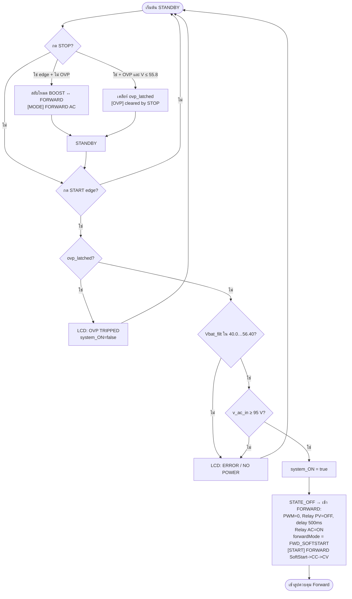
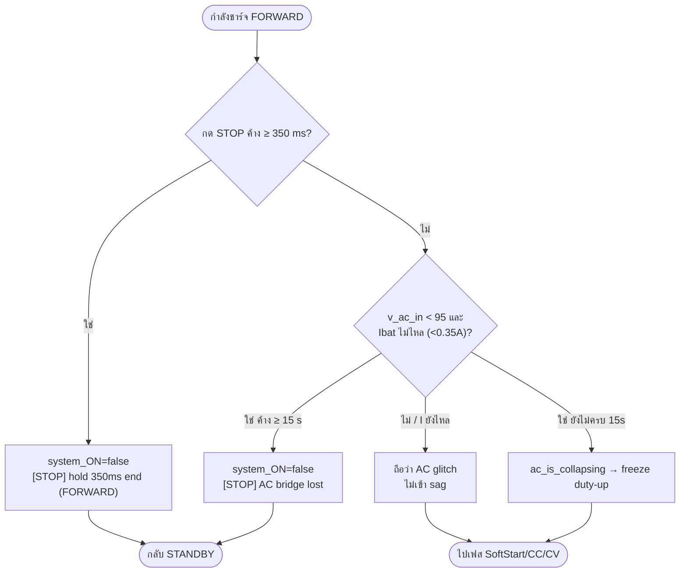
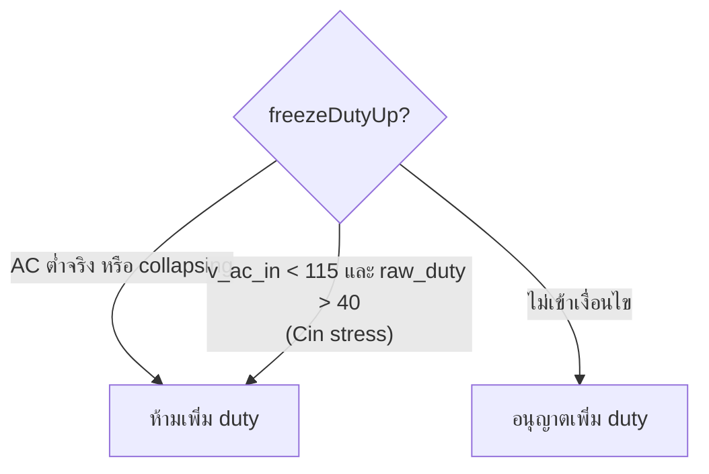
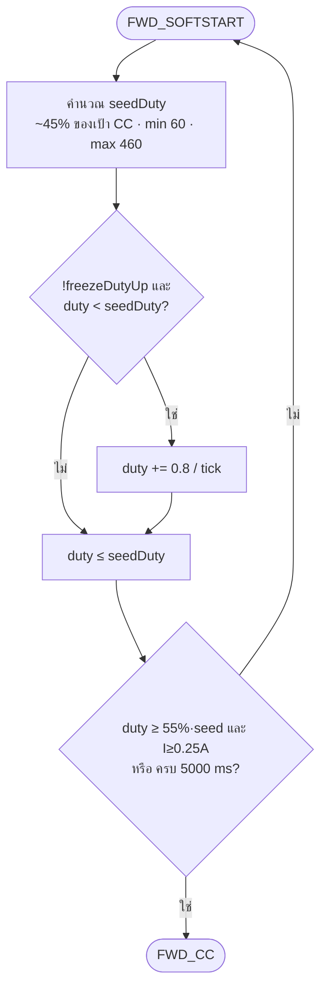
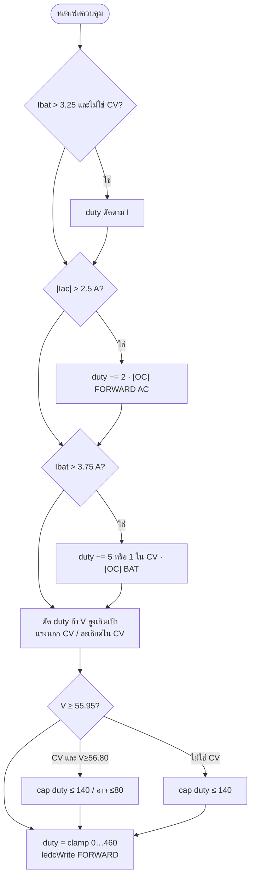

# Flowchart Forward — ตามโค้ด `cv58-boost-v14-forward-v81.ino`

ไม่ใช้ PID · SoftStart → CC → CV → DONE · step/hysteresis · ลูป ~20 ms

## 1) ปุ่ม / เข้าโหมด FORWARD



## 2) ระหว่างชาร์จ — หยุด / AC หาย



## 3) `freezeDutyUp` (ใช้ทุกเฟสตอนเพิ่ม duty)



## 4) SoftStart → CC



## 5) CC → CV

```mermaid
flowchart TD
    CC([FWD_CC]) --> IREF["iRef = 3.0 A"]
    IREF --> SAG{"v_ac_in &lt; 100?"}
    SAG -->|ใช่| IREF2["ลด iRef ตาม sag ×0.15…1"]
    SAG -->|ไม่| TAP
    IREF2 --> TAP{"Vbat_filt ≥ 54.70?"}
    TAP -->|ใช่| IREF3["taper iRef ลงหา 55.90"]
    TAP -->|ไม่| ERR
    IREF3 --> ERR["iErr = iRef − Ibat_filt"]
    ERR --> BAND{"|iErr| เทียบแบนด์ ±0.10 A"}
    BAND -->|iErr &gt; 0.10 และ !freeze| UPCC["duty += 0.6<br/>หรือ +1.2 ถ้า iErr &gt; 0.60"]
    BAND -->|iErr &lt; −0.10| DNCC["duty −= 1.5 หรือ 0.6 fine"]
    BAND -->|ในแบนด์| HOLDCC[hold duty]
    UPCC --> CVENT
    DNCC --> CVENT
    HOLDCC --> CVENT
    CVENT{"max(V,Vf) ≥ 55.30?"}
    CVENT -->|ใช่| CV([FWD_CV] force)
    CVENT -->|ไม่| CVENT2{"max(V,Vf) ≥ 55.00 นาน ≥ 200 ms?"}
    CVENT2 -->|ใช่| CV
    CVENT2 -->|ไม่| CC
```

## 6) CV → FULL / กลับ CC

```mermaid
flowchart TD
    CV([FWD_CV] เป้า 55.90 V) --> VERR["vErr = 55.90 − Vf<br/>vPeak = max(V,Vf)"]
    VERR --> OVER{"vPeak &gt; 55.90+0.25?"}
    OVER -->|ใช่| DNOVER["duty −= 1.50 + over×1.5"]
    OVER -->|ไม่| LOW{"vErr &gt; +0.05?"}
    LOW -->|ใช่| CLIMB{"!freeze และ Iabs &lt; 3A?"}
    CLIMB -->|I≤0.40 และ vErr&lt;0.60| FREEZECV[freeze duty-up ใกล้เต็ม]
    CLIMB -->|ใช่ ปีน| UPCV["duty += 0.40 หรือ 0.20 near"]
    CLIMB -->|I สูงเกิน| DNFINE["duty −= 0.35"]
    LOW -->|vErr &lt; -0.05| DNCV["duty -= over/fine/near"]
    LOW -->|ใน hold ±0.05| HOLDCV[hold = const-V]
    DNOVER --> EXITQ
    FREEZECV --> EXITQ
    UPCV --> EXITQ
    DNFINE --> EXITQ
    DNCV --> EXITQ
    HOLDCV --> EXITQ
    EXITQ{"Vf ≤ 54.50 นาน ≥ 5 s?"}
    EXITQ -->|ใช่| BACKCC([กลับ FWD_CC])
    EXITQ -->|ไม่| FULLQ
    FULLQ{"FULL slow: max(V,Vf)≥55.80 และ min(I)≤0.50<br/>นาน 15 s<br/>หรือ FULL fast: max≥55.90 และ Iabs≤0.35 นาน 5 s?"}
    FULLQ -->|ใช่| DONE["FWD_DONE + charge_full_hold<br/>PWM/relay off<br/>[FULL] FORWARD CV"]
    FULLQ -->|ไม่| CV
    DONE --> HOLD([FULL HOLD])
    HOLD --> RESUME{"Vf ≤ 54.0 และ AC≥95?"}
    RESUME -->|ใช่| BACKCC2([กลับ FWD_CC ชาร์จต่อ])
    RESUME -->|ไม่| HOLD
```

## 7) Outer safety ทุก tick (หลัง SoftStart/CC/CV)



## ค่าคงที่อ้างอิงจากโค้ด

| รายการ | ค่า |
|--------|-----|
| CC | 3.0 A |
| CV | 55.90 V |
| Dmax | 460 |
| SoftStart | seed ≈45%, step +0.8, สูงสุด 5 s |
| CC→CV | entry 55.00 (200 ms) / force 55.30 |
| FULL | 55.80+I≤0.5 @15 s หรือ 55.90+Iabs≤0.35 @5 s |
| STOP ค้าง | 350 ms |
| AC shutdown | &lt;95 V ค้าง 15 s |
| freeze climb | AC&lt;115 และ duty&gt;40 |
