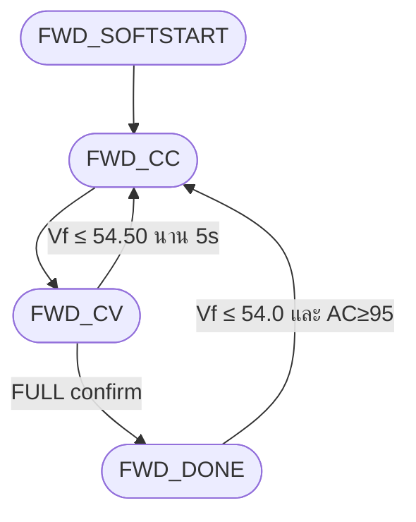
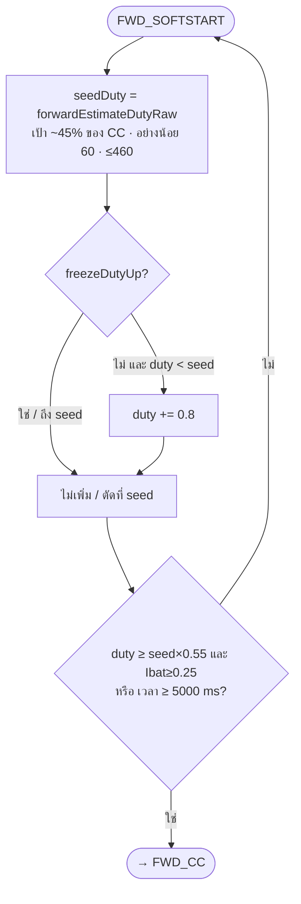

# Forward control only — `cv58-boost-v14-forward-v81`

เฉพาะ `currentState == STATE_FORWARD` และ `forwardMode`  
(ไม่รวมปุ่ม STANDBY / Boost / OVP latch)

Tick ≈ 20 ms · ไม่ใช้ PID · `MAX_DUTY_FORWARD = 460`

## ภาพรวมเฟส



## SoftStart



**freezeDutyUp** (ห้ามเพิ่ม duty):  
`(AC&lt;95 หรือ collapsing)` และไม่ใช่ glitch ตอน I ยังไหล  
**หรือ** `AC&lt;115` และ `raw_duty&gt;40`

## CC

```mermaid
flowchart TD
    A([FWD_CC]) --> B["iRef = 3.0 A"]
    B --> C{AC &lt; 100?}
    C -->|ใช่| D[ลด iRef ตาม sag]
    C -->|ไม่| E
    D --> E{Vf ≥ 54.70?}
    E -->|ใช่| F[taper iRef ลงหา 55.90]
    E -->|ไม่| G
    F --> G["iErr = iRef − Ibat_filt"]
    G --> H{iErr}
    H -->|&gt; +0.10 และ !freeze| I{"|iErr| &gt; 0.60?"}
    I -->|ใช่| J["duty += 1.2"]
    I -->|ไม่| K["duty += 0.6"]
    H -->|&lt; −0.10| L{"|iErr| &gt; 0.60?"}
    L -->|ใช่| M["duty −= 1.5"]
    L -->|ไม่| N["duty −= 0.6"]
    H -->|ใน ±0.10| O[hold duty]
    J --> P
    K --> P
    M --> P
    N --> P
    O --> P{"max(V,Vf) ≥ 55.30?"}
    P -->|ใช่| Q([→ FWD_CV] force)
    P -->|ไม่| R{"max(V,Vf) ≥ 55.00 นาน ≥ 200 ms?"}
    R -->|ใช่| Q
    R -->|ไม่| A
```

## CV

```mermaid
flowchart TD
    A([FWD_CV] เป้า 55.90 V) --> B["vErr = 55.90 − Vf<br/>vPeak = max(V,Vf)"]
    B --> C{vPeak &gt; 56.15?}
    C -->|ใช่| D["duty −= 1.50 + over×1.5"]
    C -->|ไม่| E{vErr &gt; +0.05?}
    E -->|ใช่ ต่ำกว่าเป้า| F{freeze / I?}
    F -->|I≤0.40 และ vErr&lt;0.60| G[freeze ปีน duty]
    F -->|!freeze และ Iabs&lt;3| H{"vErr &gt; 0.30?"}
    H -->|ใช่| I["duty += 0.40"]
    H -->|ไม่| J["duty += 0.20"]
    F -->|Iabs &gt; 3.15 และใกล้เป้า| K["duty −= 0.35"]
    E -->|vErr &lt; -0.05 สูงเกิน| L["duty -= ตาม over<br/>1.50 / 0.80 / 0.35"]
    E -->|ใน hold ±0.05| M[hold = คงแรงดัน]
    D --> N
    G --> N
    I --> N
    J --> N
    K --> N
    L --> N
    M --> N
    N{"Vraw &gt; Vf+1.5?"}
    N -->|ใช่| O["duty −= 1.50"]
    N -->|ไม่| P
    O --> P{"Vf ≤ 54.50 นาน ≥ 5 s?"}
    P -->|ใช่| Q([← FWD_CC])
    P -->|ไม่| R{FULL?}
    R -->|slow: maxV≥55.80 และ minI≤0.50 นาน 15s| S([→ FWD_DONE])
    R -->|fast: maxV≥55.90 และ Iabs≤0.35 นาน 5s| S
    R -->|ยังไม่| A
```

## DONE

```mermaid
flowchart TD
    A([FWD_DONE]) --> B["duty = 0 · charge_full_hold<br/>disablePowerStage · [FULL]"]
    B --> C{"Vf ≤ 54.0 และ AC ≥ 95?"}
    C -->|ใช่| D([← FWD_CC] ชาร์จต่อ)
    C -->|ไม่| A
```

## ค่าจากโค้ด

| สัญลักษณ์ | ค่า |
|-----------|-----|
| `FWD_TARGET_CC_CURRENT` | 3.0 A |
| `TARGET_CV_VOLTAGE` | 55.90 V |
| SoftStart step / time | +0.8 / 5 s |
| CC step up / far | +0.6 / +1.2 |
| CC hold band | ±0.10 A |
| CV entry / force / exit | 55.00 / 55.30 / 54.50 |
| CV hold band | ±0.05 V |
| FULL slow / fast | 15 s / 5 s |
| Dmax | 460 |
