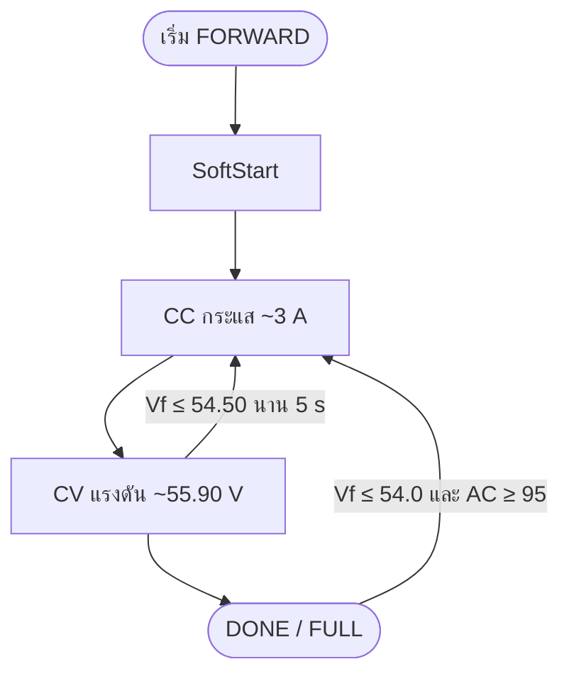
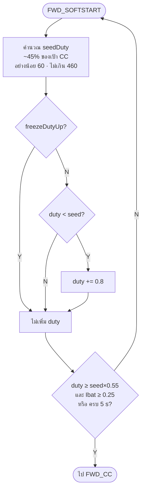
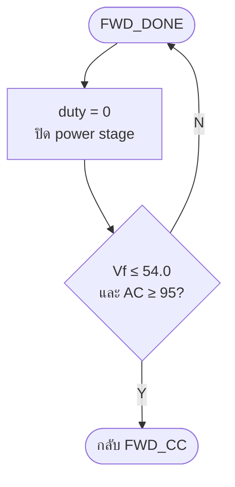

# Forward flowchart (โครงสร้างถูกต้อง)

ตามโค้ด `cv58-boost-v14-forward-v81`  
เขียนตามหลัก **Sequence / Selection / Iteration** (DO UNTIL = เช็คตอนท้าย loop)

- ไม่ใช้ PID
- SoftStart → CC → CV → DONE
- Tick ≈ 20 ms · Dmax = 460

## ภาพรวม (Sequence ของเฟส)



---

## SoftStart (Iteration = DO UNTIL พร้อม)

ลำดับ: คำนวณ seed → เพิ่ม duty (ถ้าอนุญาต) → เช็คพร้อม → ยังไม่พร้อมวนซ้ำ / พร้อมไป CC



**freezeDutyUp = ห้ามเพิ่ม duty เมื่อ**
- AC จริง ๆ อ่อน (&lt; 95 หรือ collapsing) และไม่ใช่ glitch ตอน I ยังไหล  
- **หรือ** AC &lt; 115 และ raw_duty &gt; 40

---

## CC (Iteration = DO UNTIL เข้า CV)

ลำดับ: ตั้ง iRef → ปรับ duty ตาม iErr → เช็คเข้า CV

```mermaid
flowchart TD
    A([FWD_CC]) --> B[iRef = 3.0 A]
    B --> C{AC &lt; 100?}
    C -- Y --> C1[ลด iRef ตาม sag]
    C -- N --> D
    C1 --> D{Vf ≥ 54.70?}
    D -- Y --> D1[taper iRef ลงหา 55.90]
    D -- N --> E
    D1 --> E[iErr = iRef − Ibat]
    E --> F{iErr?}
    F --|&gt; +0.10| F1{freezeDutyUp?}
    F1 -- N --> F2[เพิ่ม duty<br/>+0.6 หรือ +1.2 ถ้าระยะไกล]
    F1 -- Y --> H
    F2 --> H
    F --|&lt; −0.10| F3[ลด duty<br/>−0.6 หรือ −1.5]
    F3 --> H
    F -->|ใน ±0.10| F4[hold duty]
    F4 --> H
    H{max V ≥ 55.30?}
    H -- Y --> Z([ไป FWD_CV])
    H -- N --> I{max V ≥ 55.00<br/>นาน ≥ 200 ms?}
    I -- Y --> Z
    I -- N --> A
```

---

## CV (Iteration = DO UNTIL เต็ม หรือกลับ CC)

ลำดับ: คำนวณ vErr → ปรับ duty → เช็คออกไป CC / FULL

```mermaid
flowchart TD
    A([FWD_CV เป้า 55.90 V]) --> B[vErr = 55.90 − Vf]
    B --> C{vErr?}
    C --|&gt; +0.05 ต่ำกว่าเป้า| C1{freeze หรือ I ต่ำใกล้เต็ม?}
    C1 -- Y --> C2[hold ไม่ปีน duty]
    C1 -- N --> C3[เพิ่ม duty<br/>+0.40 หรือ +0.20]
    C -->|ใน ±0.05| C4[hold = คงแรงดัน]
    C --|&lt; −0.05 สูงเกิน| C5[ลด duty]
    C2 --> D
    C3 --> D
    C4 --> D
    C5 --> D
    D{Vf ≤ 54.50 นาน ≥ 5 s?}
    D -- Y --> BACK([กลับ FWD_CC])
    D -- N --> E{แบตเต็ม?}
    E -- Y slow --> FULL([ไป FWD_DONE])
    E -- Y fast --> FULL
    E -- N --> A
```

**แบตเต็ม**
- slow: maxV ≥ 55.80 และ minI ≤ 0.50 นาน **15 s**
- fast: maxV ≥ 55.90 และ Iabs ≤ 0.35 นาน **5 s**

---

## DONE (Iteration = DO UNTIL ต้องชาร์จต่อ)



---

## ค่าสำคัญจากโค้ด

| รายการ | ค่า |
|--------|-----|
| CC | 3.0 A |
| CV | 55.90 V |
| SoftStart step / timeout | +0.8 / 5 s |
| CC hold | ±0.10 A |
| CV hold | ±0.05 V |
| เข้า CV | 55.00 (200 ms) / force 55.30 |
| ออก CV → CC | 54.50 นาน 5 s |
| Dmax | 460 |
