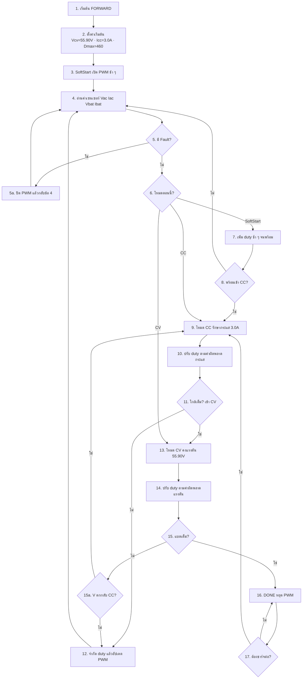
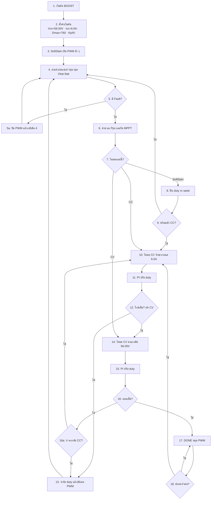

# Flowchart 1 → 2 → 3 → 4 จากบนลงล่าง

แท็ก: `cv58-boost-v14-forward-v83`

---

## FORWARD

---

## BOOST

---

## สรุปลำดับหลัก (สั้นสุด)

**FORWARD / BOOST เหมือนกันแนวนี้:**

1. เริ่มต้น  
2. ตั้งค่า  
3. SoftStart  
4. อ่านเซนเซอร์  
5. เช็ค Fault  
6. CC รักษากระแส  
7. CV คงแรงดัน  
8. DONE หยุด  
