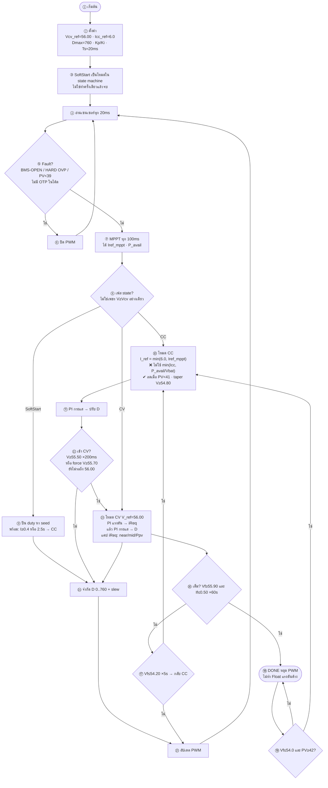
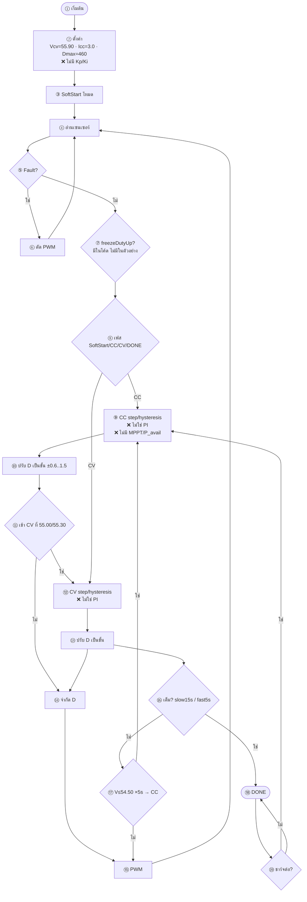

# จุดที่ต่างจากตัวอย่าง vs โค้ดจริง

แท็ก: `cv58-boost-v14-forward-v83`  
ตัวอย่าง = รูป SoftStart → CC/CV/Float แบบทั่วไป  
โค้ด = พฤติกรรมจริงในเฟิร์มแวร์

---

## BOOST — ต่างจากตัวอย่างกี่จุด

### ตารางจุดต่าง BOOST

| # | เรื่อง | ตัวอย่าง | โค้ดจริง |
|---|--------|---------|----------|
| 1 | แยก CC/CV | เพชร `Vbat ≥ Vcv_ref` ทุกรอบ | state: SoftStart→CC→CV→DONE |
| 2 | เข้า CV | เมื่อถึง **Vcv_ref (56.0)** | เข้าเร็วที่ **55.50 / 55.70** |
| 3 | I_ref ใน CC | `min(Icc, P_avail/Vbat)` | **ไม่แคปจาก Ppv** (กันติดกระแสต่ำ) |
| 4 | ควบคุม CV | PI แรงดัน → D โดยตรง | **PI แรงดัน → iReq → PI กระแส → D** |
| 5 | SoftStart | ทำครั้งเดียวตอนเริ่ม | เป็นโหมด วนจนพร้อม |
| 6 | เต็มแล้ว | Float หรือหยุด | **DONE หยุด PWM** (ไม่ float) |
| 7 | OTP | มีใน Fault | **ไม่มี** |
| 8 | ออก CV→CC | ไม่เน้นในรูป | มี: Vf≤**54.20** นาน 5s |
| 9 | MPPT | ทุกวงรอบ | ทุก **100 ms** |

---

## FORWARD — ต่างจากตัวอย่างมากขึ้น

### ตารางจุดต่าง FORWARD

| # | เรื่อง | ตัวอย่าง | โค้ดจริง |
|---|--------|---------|----------|
| 1 | ตัวควบคุม | PI (Kp/Ki) | **step / hysteresis** |
| 2 | MPPT / P_avail | มี | **ไม่มี** (ชาร์จจาก AC) |
| 3 | แยกโหมด | V ≥ Vcv ทุกรอบ | state SoftStart→CC→CV→DONE |
| 4 | freezeDutyUp | ไม่มี | **มี** กัน AC อ่อน / Cin |
| 5 | Vcv_ref | มัก 56 V | **55.90 V** |
| 6 | Icc_ref | 6 A ในรูป Boost | **3.0 A** |
| 7 | FULL | I ≤ I_cutoff × T_end | slow **15s** + fast **5s** |
| 8 | Float | มีในตัวอย่าง | **DONE หยุด** |

---

## สรุปสั้น

- **ตัวอย่าง** = แผนภาพสอนโครง CC/CV ทั่วไป  
- **BOOST ในโค้ด** ≈ ตัวอย่าง แต่ต่างที่การเข้า CV, ไม่แคป CC จาก Ppv, CV ใช้ PI สองชั้น, ไม่มี Float/OTP  
- **FORWARD ในโค้ด** = โครงเฟสเดียวกัน แต่ **ไม่มี PID/MPPT** ใช้ step แทน
