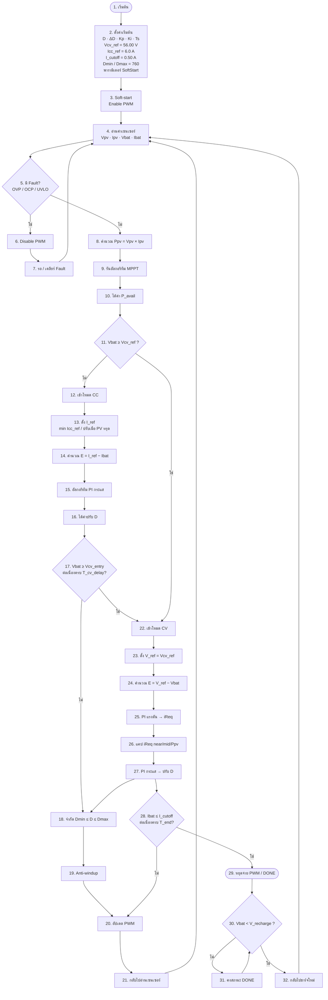
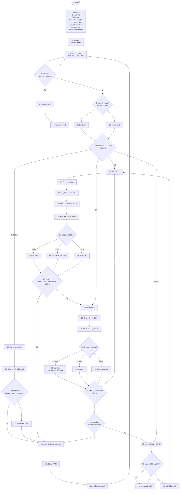

# Flowchart ใส่เลขทุกช่อง จากบนลงล่าง

ทุกกล่องมีเลข 1, 2, 3, 4… เรียงตามลำดับ  
แท็ก: `cv58-boost-v14-forward-v83`

---

## BOOST — เลขครบทุกตำแหน่ง

| เลข | ช่อง | ความหมาย |
|----:|------|----------|
| 1 | เริ่มต้น | จุดเริ่ม |
| 2 | ตั้งค่า | พารามิเตอร์ทั้งหมด |
| 3 | Soft-start | เปิด PWM |
| 4 | อ่านเซนเซอร์ | จุดวนหลัก |
| 5 | Fault? | ตัดสินใจ |
| 6–7 | ปิด PWM / รอ | สาขา Fault |
| 8–10 | Ppv / MPPT / P_avail | คำนวณกำลัง |
| 11 | Vbat ≥ Vcv? | แยก CC/CV |
| 12–17 | โหมด CC | กระแสคงที่ |
| 18–21 | จำกัด D → PWM → วน | รวมทาง |
| 22–28 | โหมด CV | แรงดันคงที่ |
| 29–32 | DONE / ชาร์จต่อ | จบ |

---

## FORWARD — เลขครบทุกตำแหน่ง

| เลข | ช่อง |
|----:|------|
| 1–3 | เริ่ม / ตั้งค่า / Soft-start |
| 4–7 | อ่านเซนเซอร์ + Fault |
| 8–10 | freezeDutyUp |
| 11–15 | SoftStart |
| 16–25 | CC |
| 26–34 | CV |
| 36–39 | จำกัด D + PWM + วนกลับ |
| 37, 40–42 | DONE / ชาร์จต่อ |
