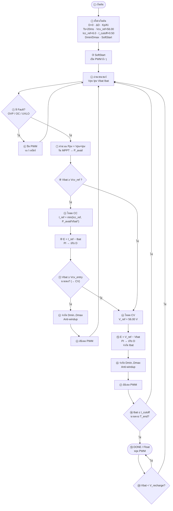
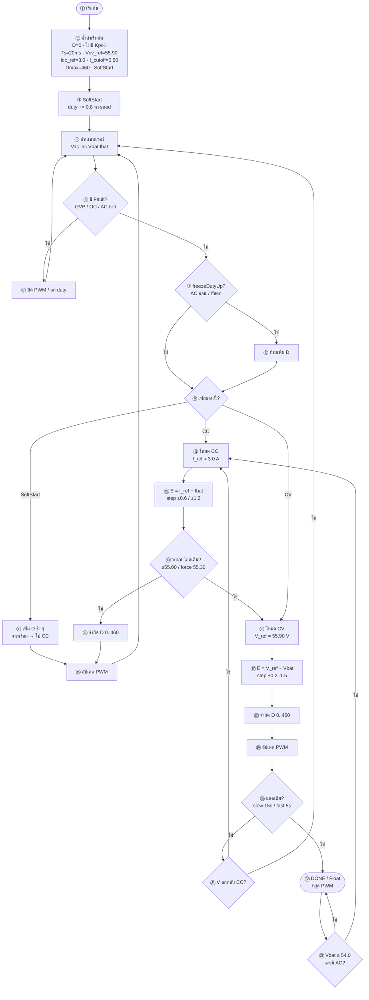

# Flowchart แบบตัวอย่าง — มีหมายเลขลำดับ

โครงสร้างเหมือนตัวอย่าง: SoftStart → อ่านเซนเซอร์ → Fault → CC/CV → PWM → DONE/Float  
แท็ก: `cv58-boost-v14-forward-v83`

---

## 1) BOOST (PV) — ใช้ PI ตามตัวอย่าง

ค่าหลัก: `Icc_ref = 6 A` · `Vcv_ref = 56.00 V` · `Dmax = 760` · `Ts ≈ 20 ms`

\*ในโค้ดจริง CC **ไม่แคป** Iref จาก Ppv (กันติดกระแสต่ำ) — ลด Iref เมื่อ PV ทรุดเท่านั้น  
ใน **CV** จะแคป iReq ตามกำลัง PV (v83) เพื่อไม่ให้แกว่ง

| เลข | ขั้นตอน |
|----:|---------|
| ①–③ | เริ่ม + SoftStart |
| ④–⑦ | อ่านค่า + Fault + MPPT |
| ⑧–⑬ | สาขา CC |
| ⑭–⑱ | สาขา CV |
| ⑲–⑳ | เต็มแล้ว / ชาร์จต่อ |

---

## 2) FORWARD (AC) — โครงเดียวกับตัวอย่าง แต่**ไม่ใช้ PID**

ค่าหลัก: `Icc_ref = 3 A` · `Vcv_ref = 55.90 V` · `Dmax = 460` · step/hysteresis

| เลข | ขั้นตอน |
|----:|---------|
| ①–③ | เริ่ม + SoftStart |
| ④–⑧ | อ่านค่า + Fault + กัน AC อ่อน |
| ⑨–⑮ | SoftStart / CC |
| ⑯–㉑ | CV |
| ㉒–㉓ | เต็มแล้ว / ชาร์จต่อ |

---

## สรุปเทียบตัวอย่าง

| รายการ | ตัวอย่างในรูป | BOOST ในโค้ด | FORWARD ในโค้ด |
|--------|---------------|--------------|----------------|
| SoftStart | มี | มี | มี |
| อ่านเซนเซอร์ → Fault | มี | มี | มี |
| MPPT / P_avail | มี | มี | ไม่มี (ใช้ AC) |
| CC แล้วเข้า CV | มี | มี (PI) | มี (step) |
| เต็ม → Float/DONE | มี | มี | มี |
| ชาร์จต่อเมื่อ V ตก | มี | มี | มี |
