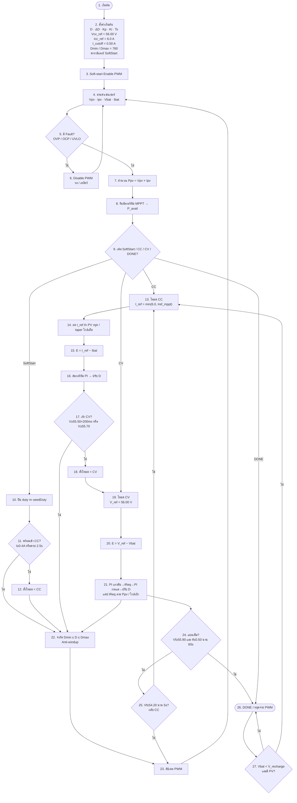
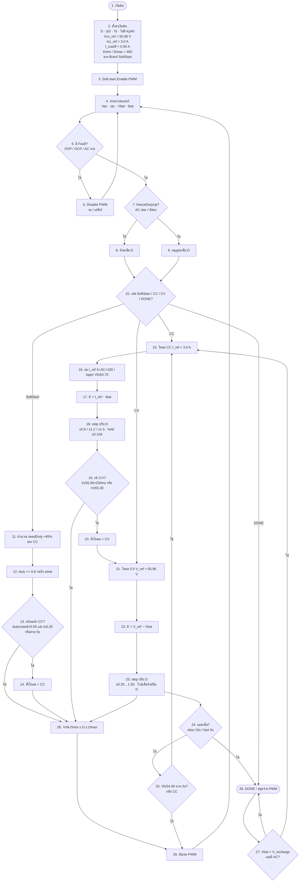

# Flowchart หมายเลขทุกช่อง 1 → 2 → 3 → … จากบนลงล่าง

ทุกกล่อง/เพชรมีเลข · เรียงจากน้อยไปมากตามแนวตั้ง  
แท็ก: `cv58-boost-v14-forward-v83`

---

## BOOST (PV) — ใช้ PI

| เลข | ขั้นตอน |
|----:|---------|
| 1–3 | เริ่ม + ตั้งค่า + SoftStart |
| 4–8 | อ่านเซนเซอร์ → Fault → Ppv/MPPT |
| 9–12 | SoftStart จนพร้อม |
| 13–18 | CC + ตัดสินใจเข้า CV |
| 19–21 | CV |
| 22–23 | จำกัด D + PWM แล้ววนกลับข้อ 4 |
| 24–27 | เต็ม / ชาร์จต่อ |

---

## FORWARD (AC) — ไม่ใช้ PID

| เลข | ขั้นตอน |
|----:|---------|
| 1–3 | เริ่ม + ตั้งค่า + SoftStart |
| 4–9 | อ่านเซนเซอร์ → Fault → freezeDutyUp |
| 10–14 | SoftStart จนพร้อม |
| 15–20 | CC + เข้า CV |
| 21–23 | CV |
| 24–27 | เต็ม / ชาร์จต่อ |
| 28–29 | จำกัด D + PWM แล้ววนกลับข้อ 4 |

---

## หลักการจัดเลข

- ทุกช่องมีเลข  
- เรียง **จากบนลงล่าง จากน้อยไปมาก**  
- ลูกศรกลับ (เช่น Fault → ข้อ 4, PWM → ข้อ 4) ชี้กลับเลขที่น้อยกว่าได้  
- แยกสาขา CC/CV แล้วนับต่อเนื่อง ไม่ข้ามเลข
