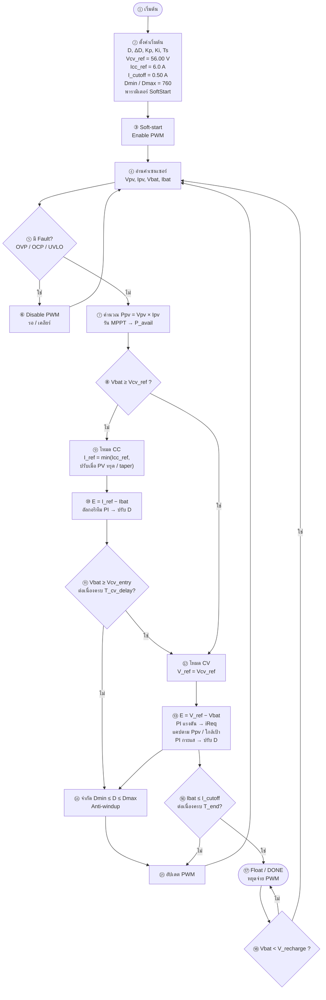
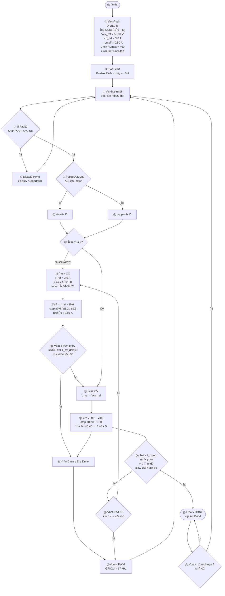

# Flowchart จัดวางแบบตัวอย่าง + หมายเลข

โครงเดียวกับตัวอย่าง:  
**เริ่ม → SoftStart → อ่านเซนเซอร์ → Fault → คำนวณ → แยก CC|CV → จำกัด D → อัปเดต PWM → วนกลับ → DONE/Float**

แท็ก: `cv58-boost-v14-forward-v83`

---

## BOOST (PV) — ตรงตัวอย่าง · ใช้ PI

### ค่าในโค้ด BOOST

| สัญลักษณ์ | ค่า | เลขที่เกี่ยวข้อง |
|-----------|-----|------------------|
| Vcv_ref | 56.00 V | ② ⑧ ⑫ |
| Icc_ref | 6.0 A | ② ⑨ |
| Vcv_entry / force | 55.50 / 55.70 | ⑪ |
| T_cv_delay | 200 ms | ⑪ |
| I_cutoff | 0.50 A | ⑯ |
| T_end | 60 s | ⑯ |
| V_recharge | 54.0 V | ⑱ |
| Dmax | 760 | ⑭ |
| Ts | ≈ 20 ms | ② |
| CV exit → CC | Vf ≤ 54.20 นาน 5 s | (ใน ⑫–⑯) |

---

## FORWARD (AC) — จัดวางเหมือนตัวอย่าง · ไม่ใช้ PID

### ค่าในโค้ด FORWARD

| สัญลักษณ์ | ค่า | เลขที่เกี่ยวข้อง |
|-----------|-----|------------------|
| Vcv_ref | 55.90 V | ② ⑭ |
| Icc_ref | 3.0 A | ② ⑪ |
| Vcv_entry / force | 55.00 / 55.30 | ⑬ |
| T_cv_delay | 200 ms | ⑬ |
| I_cutoff | 0.50 A (slow) / 0.35 A (fast) | ⑱ |
| T_end | 15 s / 5 s | ⑱ |
| V_recharge | 54.0 V | ㉑ |
| Dmax | 460 | ⑯ |
| SoftStart | seed≈45% · +0.8 · 5 s | ③ |
| freezeDutyUp | AC&lt;95 หรือ AC&lt;115 &amp; D&gt;40 | ⑦ ⑧ |

---

## เทียบกับตัวอย่าง

| จุดจัดวางในตัวอย่าง | BOOST | FORWARD |
|---------------------|-------|---------|
| แถวบน: เริ่ม + SoftStart | ①–③ | ①–③ |
| กลางบน: อ่านเซนเซอร์ (จุดวน) | ④ | ④ |
| เพชร Fault แล้วกลับ | ⑤–⑥ | ⑤–⑥ |
| คำนวณก่อนแยกโหมด | ⑦ MPPT | ⑦–⑨ freeze |
| เพชรกลาง แยก CC \| CV | ⑧ | ⑩ |
| สาขาซ้าย CC | ⑨–⑪ | ⑪–⑬ |
| สาขาขวา CV | ⑫–⑬ | ⑭–⑮ |
| รวมทาง จำกัด D + PWM | ⑭–⑮ | ⑯–⑰ |
| ลูกศรกลับไปอ่านเซนเซอร์ | ⑮→④ | ⑰→④ |
| ล่าง Float / ชาร์จต่อ | ⑯–⑱ | ⑱–㉑ |
