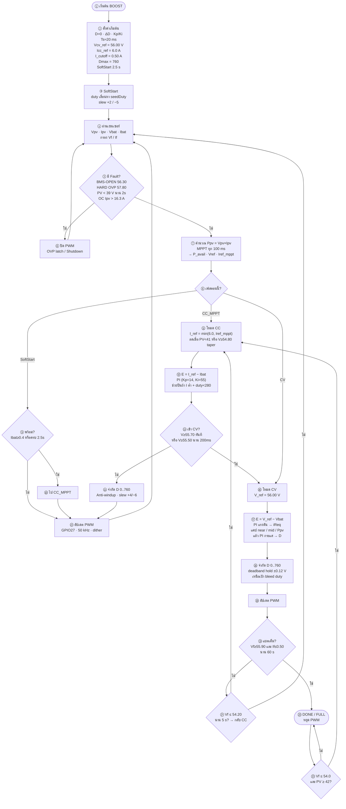
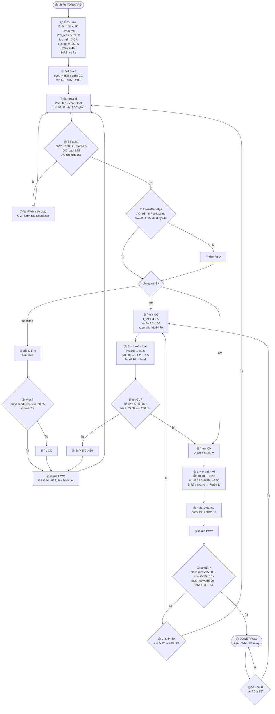

# Flowchart มีหมายเลข + รายละเอียด

แท็ก: `cv58-boost-v14-forward-v83`  
โครงแบบตัวอย่าง: SoftStart → อ่านเซนเซอร์ → Fault → CC/CV → PWM → DONE  
อ่านตามเลข **① → ⑳**

---

## 1) BOOST (PV) — ใช้ PI · CC 6 A · CV 56.00 V

### รายละเอียด Boost ตามเลข

| เลข | รายละเอียดจากโค้ด |
|----:|---------------------|
| ② | `boostNewResetOnEntry` · Iref_mppt เริ่ม = 6 A · PvRef ≈ Vpv |
| ③–⑩ | SoftStart: `boostEstimateDutyRaw` · พร้อมเมื่อ I≥0.4 หรือ 2500 ms |
| ⑦ | MPPT: ก้าว Vref ±0.10 V ช่วง 40–45 · Iref_mppt += 0.08×(Vpv−Vref) |
| ⑪ | CC: ไม่แคป Iref จาก Ppv · ลดเมื่อ PV ทรุด / taper ใกล้เต็ม |
| ⑫ | PI กระแส · dDuty จำกัดด้วย slew |
| ⑬ | เข้า CV ที่ 55.50 (200 ms) หรือ force 55.70 |
| ⑰ | CV: แคป iReq near/mid + **Ppv** (v83) · Iref slew 0.04 A/tick |
| ⑳ | FULL: Vf≥55.90 และ If≤0.50 นาน 60 s |
| ㉑ | ออก CV→CC เมื่อ Vf≤54.20 นาน 5 s |
| ㉓ | ชาร์จต่อเมื่อ Vf≤54.0 และมี PV |

---

## 2) FORWARD (AC) — โครงเดียวกับตัวอย่าง · **ไม่ใช้ PID**

เป้า: SoftStart → CC 3 A → CV 55.90 V · step/hysteresis · Dmax 460

### รายละเอียด Forward ตามเลข

| เลข | รายละเอียดจากโค้ด |
|----:|---------------------|
| ② | `forwardNewResetOnEntry` · forwardMode = SoftStart |
| ③–⑫ | SoftStart: seed จาก `forwardEstimateDutyRaw` · step +0.8 · พร้อมตาม ⑪ |
| ⑦–⑧ | `freezeDutyUp` กัน Cin / AC อ่อน (ไม่ถือ AC=0 ปลอมตอน I ยังไหล) |
| ⑬–⑭ | CC step/hysteresis · hold ±0.10 A |
| ⑮ | เข้า CV: force 55.30 หรือ entry 55.00 × 200 ms |
| ⑱–㉑ | CV step · hold ±0.05 V · freeze ปีนเมื่อ I≤0.40 ใกล้เป้า |
| ㉒ | FULL slow 15 s / fast 5 s |
| ㉓ | ออก CV→CC เมื่อ Vf≤54.50 นาน 5 s |
| ㉕ | ชาร์จต่อจาก DONE เมื่อ Vf≤54.0 และมี AC |

---

## ค่าสำคัญเทียบกัน

| รายการ | BOOST | FORWARD |
|--------|------:|--------:|
| ควบคุม | PI | step / hysteresis |
| CC | 6.0 A | 3.0 A |
| CV | 56.00 V | 55.90 V |
| PWM | 50 kHz · GPIO27 | 67 kHz · GPIO14 |
| Dmax | 760 | 460 |
| SoftStart | 2.5 s | 5 s |
| FULL | 60 s | 15 s / 5 s |
| ออก CV→CC | 54.20 V × 5 s | 54.50 V × 5 s |
