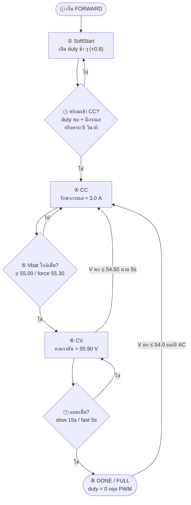
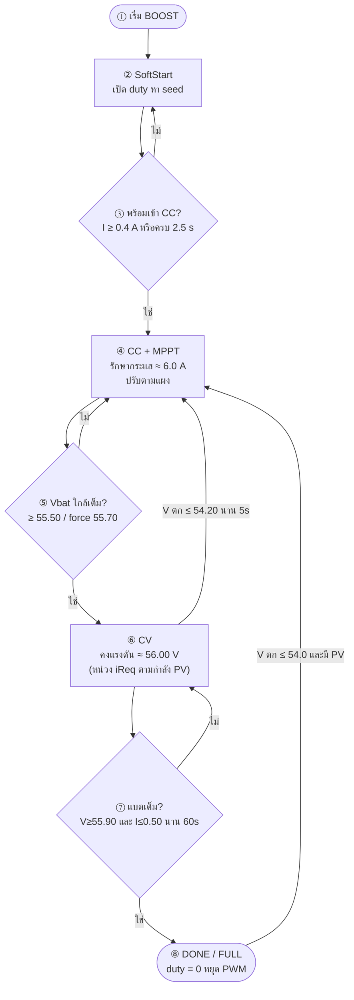
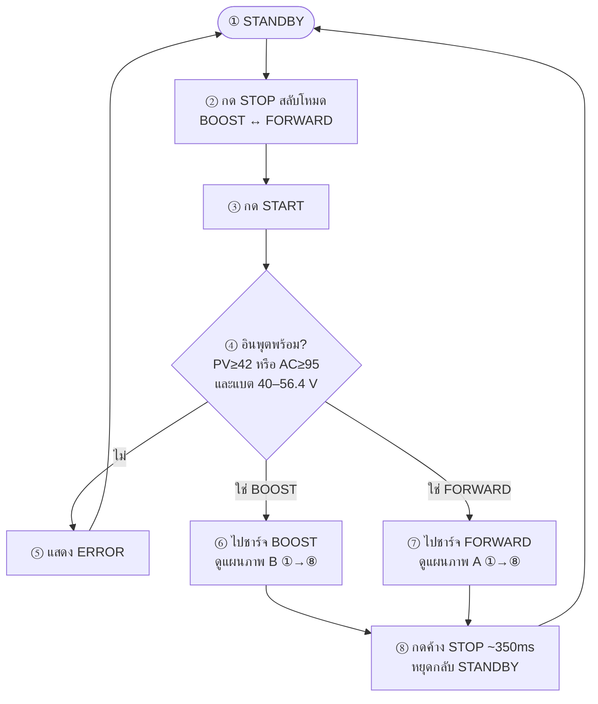

# Flowchart เข้าใจง่าย — มีหมายเลขลำดับ

แท็ก: `cv58-boost-v14-forward-v83`  
อ่านตามเลข **① → ② → ③ …**

---

## A) โหมด FORWARD (AC) — ไม่ใช้ PID

เป้า: SoftStart → CC 3 A → CV 55.90 V → เต็มแล้วหยุด

| ลำดับ | ความหมายสั้น ๆ |
|------:|----------------|
| ① | กด START โหมด FORWARD |
| ② | เปิด PWM ช้า ๆ ไม่กระแทก Cin |
| ③ | พร้อมแล้วค่อยไปดึงกระแส |
| ④ | ล็อกกระแสชาร์จ ~3 A |
| ⑤ | แรงดันขึ้นใกล้เต็ม → เข้า CV |
| ⑥ | ล็อกแรงดัน ~55.9 V |
| ⑦ | เช็คว่าเต็มจริง |
| ⑧ | เต็มแล้วหยุด |

---

## B) โหมด BOOST (PV) — ใช้ PI

เป้า: SoftStart → CC+MPPT 6 A → CV 56.00 V → เต็มแล้วหยุด

| ลำดับ | ความหมายสั้น ๆ |
|------:|----------------|
| ① | กด START โหมด BOOST |
| ② | เปิด PWM ช้า ๆ |
| ③ | พร้อมแล้วเข้า CC |
| ④ | ดึงกระแส ~6 A + ตามจุดกำลังแผง |
| ⑤ | ใกล้เต็ม → เข้า CV |
| ⑥ | คง ~56.0 V (ไม่ขอกระแสเกินที่แผงมี) |
| ⑦ | เช็คว่าเต็มจริง |
| ⑧ | เต็มแล้วหยุด |

---

## C) ภาพรวมทั้งระบบ (เลือกโหมด)

