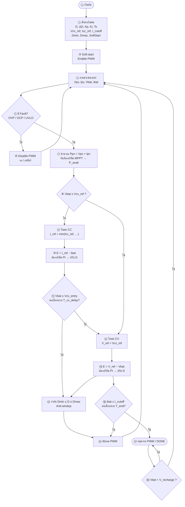
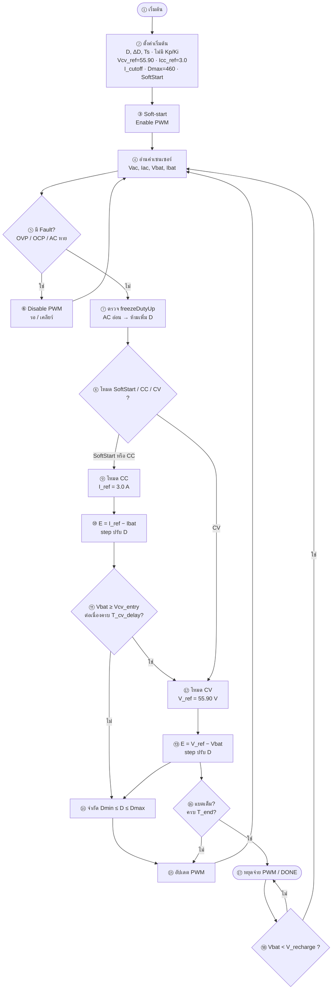

# Flowchart จัดวางบน→ล่าง แบบตัวอย่าง

ลำดับแนวตั้งเหมือนตัวอย่างทุกขั้น  
แท็ก: `cv58-boost-v14-forward-v83`

---

## BOOST (PV)

**ลำดับบน→ล่าง**
1. เริ่มต้น  
2. ตั้งค่า  
3. Soft-start  
4. อ่านเซนเซอร์ ← *จุดวนกลับ*  
5. Fault?  
6. (ถ้าใช่) ปิด PWM แล้วกลับ ④  
7. คำนวณ Ppv / MPPT  
8. แยก CC / CV  
9–⑪ สาขา CC  
12–⑬ สาขา CV  
14. จำกัด D  
15. อัปเดต PWM → กลับ ④  
16–⑱ เต็ม / ชาร์จต่อ  

---

## FORWARD (AC) — วางแนวเดียวกัน

**ลำดับบน→ล่าง** เหมือน BOOST  
ต่างแค่ ⑦ ไม่มี MPPT / ใช้ step แทน PI
