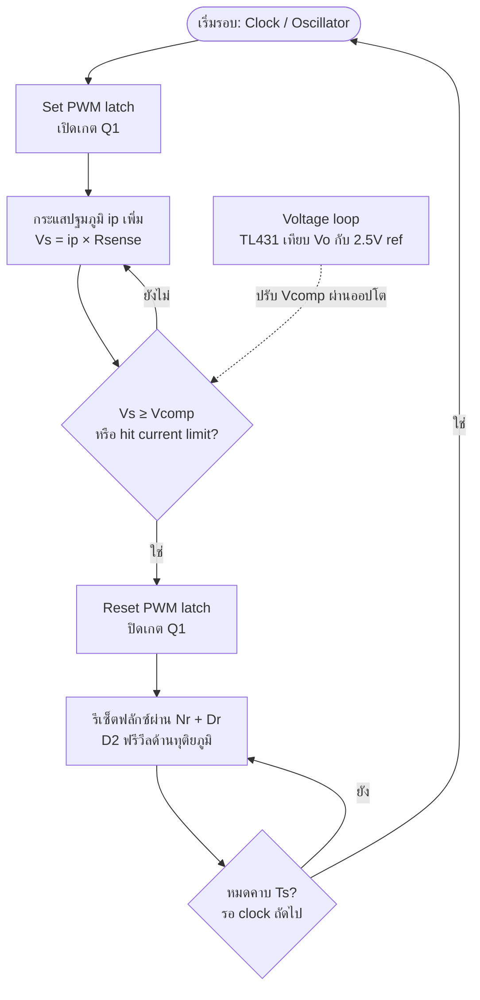
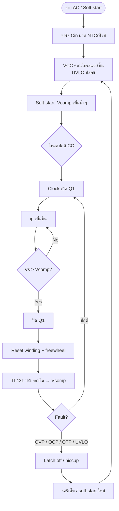
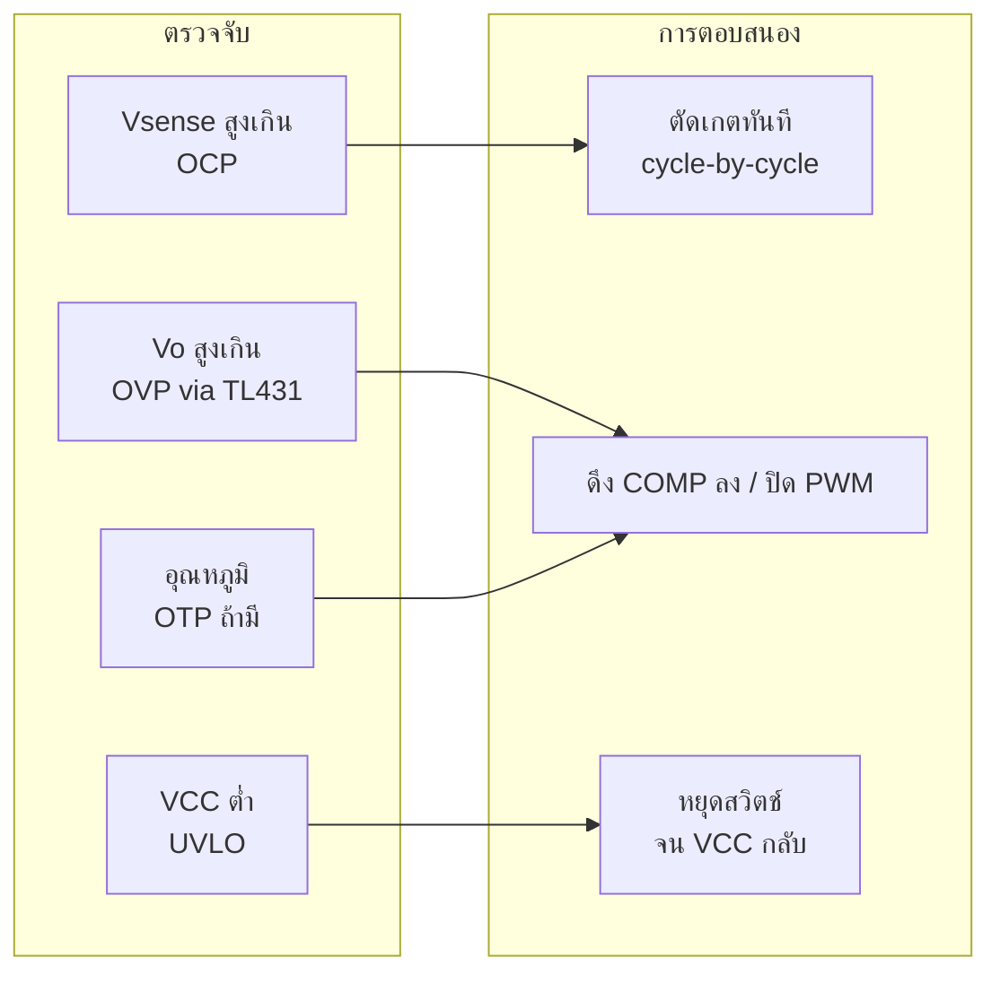

# โฟลว์ชาร์ต Current Mode Control (CC) — Forward Converter

Peak **Current Mode Control** สำหรับ Single-Switch Forward + Nr  
สเปก: AC 240 V → DC 58 V / 5 A | \(f_s \approx 65\,\mathrm{kHz}\) | Q1 = STW20N95K5

---

## 1. บล็อกไดอะแกรมระบบ

```text
                    ┌─────────────────────────────────────────┐
   AC 240V → Bridge → Cin → [Forward + Nr] → LC → Vo 58V/5A  │
                    │         Q1 STW20N95K5                    │
                    │              ▲ gate                      │
                    │         Driver 10–12V                    │
                    │              ▲                           │
                    │         PWM latch (UC384x ฯลฯ)           │
                    │         ▲           ▲                    │
                    │    Vsense      Vcomp (จากออปโต)         │
                    │    (Rsense)         ▲                    │
                    │                     │                    │
                    │              Opto ← TL431 ← Vo           │
                    └─────────────────────────────────────────┘
```

| ลูป | หน้าที่ |
|-----|---------|
| **Current loop (เร็ว)** | เปรียบเทียบ \(v_{sense}=i_p R_s\) กับ \(v_c\) → ตัดเกตเมื่อถึงพีค |
| **Voltage loop (ช้า)** | TL431 + ออปโต ปรับ \(v_c\) ให้ \(V_o=58\,\mathrm{V}\) |

---

## 2. โฟลว์ชาร์ตต่อรอบสวิตช์ (Peak CC)



### คำอธิบายสั้น

1. **Clock** เปิด MOSFET ทุกต้นรอบ  
2. กระแส \(i_p\) ไหลผ่าน \(R_{sense}\) → \(V_s\)  
3. เมื่อ \(V_s \ge V_{comp}\) → **ปิดเกตทันที** (cycle-by-cycle)  
4. ช่วง OFF: Nr รีเซ็ตแกน, D2 ฟรีวีล  
5. TL431 ดู \(V_o\) แล้วดึงออปโต → เปลี่ยน \(V_{comp}\) (ตั้งพีคกระแส)

---

## 3. โฟลว์ชาร์ตลำดับทำงานทั้งระบบ



---

## 4. โฟลว์ชาร์ตป้องกัน (Protection)



---

## 5. สัญญาณสำคัญในหนึ่งคาบ

```text
Clock   : ─┐                 ┌──────────────
           └─────────────────┘
Gate    : ─┐  ┌──┐           ┌──┐
           └──┘  └───────────┘  └────  (ตันเมื่อ Vs=Vcomp)
ip / Vs :    ／|                ／|
           ／  |              ／  |
          ／   └────────────／    └──
               ↑
            Vs = Vcomp  → ปิดเกต
Vcomp   : ────────────────  (ช้า จากลูปแรงดัน)
```

ภาพรวม: `artifacts/flowchart_cc_forward.png`

ข้อจำกัด Forward + Nr: **\(D < 0.5\)** (เมื่อ \(N_r=N_p\)) — ตั้ง max duty ที่คอนโทรลเลอร์ / ramp

---

## 6. จุดเชื่อมกับฮาร์ดแวร์ดีไซน์นี้

| จุด | ค่าแนวทาง |
|-----|-----------|
| \(R_{sense}\) | ให้ \(V_s\) พีค ≈ 0.8–1.0 V ที่ \(I_{p}\approx 3\,\mathrm{A}\) → \(R_s \approx 0.27\text{–}0.33\,\Omega\) / ≥ 2 W |
| Soft-start | คาปาซิเตอร์ที่ขา SS ของ UC3842/3/4/5 |
| Slope compensation | แนะนำใส่เมื่อ \(D>0.4\) (ที่ Vin ต่ำ D≈0.44) |
| Max duty | จำกัด < 0.45 |
| Gate | 10–12 V ไป STW20N95K5 |

---

## 7. สรุปหนึ่งประโยค

**Clock เปิด Q1 → กระแสขึ้นจน Vs ชน Vcomp แล้วปิด → Nr รีเซ็ต → TL431 ปรับ Vcomp ให้ Vo = 58 V**
