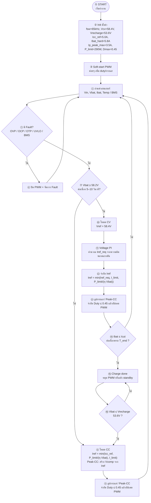

# โฟลว์ชาร์ต CC → CV — Forward Converter (มีหมายเลข + อธิบายไทย)

Single-Switch Forward + Nr | AC 240 V → ชาร์จแบต **58.4 V / 5 A** | \(f_s=65\,\mathrm{kHz}\) | Q1 = STW20N95K5

ไฟล์ Mermaid: [`flowchart-cc-cv-forward.mmd`](flowchart-cc-cv-forward.mmd)

---

## แผนภาพรวม (หมายเลข ①–⑯)

---

## อธิบายแต่ละขั้น (ภาษาไทย)

| ขั้น | ชื่อ | คำอธิบาย |
|------|------|----------|
| **①** | START | เปิดเครื่อง / เริ่มเฟิร์มแวร์คอนโทรลเลอร์ |
| **②** | Init ตั้งค่า | โหลดพารามิเตอร์: ความถี่ 65 kHz, เป้า CV 58.4 V, จุดรีชาร์จ 53.6 V, กระแส CC 5 A, ลิมิตกระแส/กำลัง, **Dmax=0.45** (เพื่อรีเซ็ตขด Nr) |
| **③** | Soft-start PWM | ค่อยๆ เปิดสวิตช์ ไม่ให้กระแสพุ่งตอนสตาร์ท (เพิ่ม Vcomp หรือ Duty ช้าๆ) |
| **④** | อ่านเซนเซอร์ | วัดแรงดันบัสอินพุต \(V_{in}\), แรงดันแบต \(V_{bat}\), กระแสชาร์จ \(I_{bat}\), อุณหภูมิ และสถานะ BMS |
| **⑤** | ตรวจ Fault | เช็กผิดปกติ: แรงดันเกิน (OVP), กระแสเกิน (OCP), อุณหภูมิเกิน (OTP), แรงดันต่ำ (UVLO), BMS ตัด |
| **⑥** | จัดการ Fault | ปิด PWM ทันที แล้ววนกลับไปอ่านค่าใหม่ / รอเคลียร์ฟอลต์ก่อนทำงานต่อ |
| **⑦** | เงื่อนไขเข้า CV | ถ้า \(V_{bat}\) คงที่ ≥ 58.2 V นาน 5–10 วินาที → พร้อมเข้าโหมดแรงดันคงที่; ยังไม่ถึง → อยู่โหมด CC |
| **⑧** | โหมด CC | ชาร์จกระแสคงที่: ตั้ง \(I_{ref}\) จากค่าที่น้อยที่สุดระหว่าง 5 A, ลิมิตกำลัง \(P/(ηV_{bat})\), และลิมิตฮาร์ดแวร์ แล้วแปลงเป็น Vcomp สำหรับ Peak-CC |
| **⑨** | อัปเดต PWM (CC) | ลูปกระแส/Peak-CC ปรับ Duty หรือพีคกระแส แล้ว **คลัมป์ Duty ≤ 0.45** จากนั้นอัปเดตเกต MOSFET แล้วกลับไป ④ |
| **⑩** | โหมด CV | เปลี่ยนเป้าเป็นแรงดันคงที่ \(V_{ref}=58.4\,\mathrm{V}\) (ดูดซับชาร์จช่วงท้าย) |
| **⑪** | Voltage PI | คำนวณความผิดพลาด \(e=V_{ref}-V_{bat}\) ผ่าน PI ได้ \(I_{ref,req}\) (กระแสที่ต้องการเพื่อคุมแรงดัน) |
| **⑫** | จำกัด Iref | กันกระแสเกิน: \(I_{ref}=\min(I_{ref,req},\,I_{limit},\,P_{limit}/(ηV_{bat}))\) |
| **⑬** | อัปเดต PWM (CV) | เหมือนขั้น ⑨ แต่ใช้ \(I_{ref}\) จากลูปแรงดัน — ยังต้อง **D ≤ 0.45** |
| **⑭** | จบชาร์จ? | ถ้ากระแสแบต \(I_{bat}\) ต่ำกว่า \(I_{cut}\) (เช่น 0.25–0.5 A) ต่อเนื่องครบเวลา \(T_{end}\) → ชาร์จเต็ม |
| **⑮** | Charge done | หยุด PWM หรือเข้าโหมดพัก (standby) ไม่ฉีดกระแสเข้าแบต |
| **⑯** | รีชาร์จ? | ถ้า \(V_{bat}\) ลดลง ≤ 53.6 V → กลับไปโหมด CC (⑧) เพื่อชาร์จใหม่; ยังสูงอยู่ → คงสถานะ done |

---

## ค่าตัวเลขที่ใช้ในไดอะแกรม

| สัญลักษณ์ | ค่า | ความหมาย |
|-----------|-----|----------|
| `fsw` | **65 kHz** | ความถี่สวิตช์ Forward |
| `Vcv` | **58.4 V** | แรงดันเป้าโหมด CV |
| เกณฑ์เข้า CV | **58.2 V / 5–10 s** | กันสลับโหมดรัวจากริปเปิล |
| `Vrecharge` | **53.6 V** | จุดเริ่มชาร์จรอบใหม่ |
| `Icc_ref` | **5.0 A** | กระแสเป้าโหมด CC |
| `Ibat_hard` | **5.8 A** | ลิมิตกระแสเอาต์พุตฉุกเฉิน |
| `Ip_peak_max` | **3.5 A** | ลิมิตพีคกระแสปฐมภูมิ |
| `P_limit` | **290 W** | ลิมิตกำลัง (≈ 58×5) |
| `Dmax` | **0.45** | Duty สูงสุด (Nr = Np ต้องรีเซ็ตฟลักซ์ทัน) |
| `Icut` | ≈ 0.25–0.5 A | กระแสตัดจบชาร์จ (5–10% ของ 5 A) |
| `η` | ≈ 0.88–0.90 | ประสิทธิภาพโดยประมาณ |

---

## ลำดับสั้นๆ ท่องจำ

1. **ตั้งค่า → Soft-start → อ่านเซนเซอร์**  
2. **มีฟอลต์ → ปิด PWM**  
3. **ยังไม่เต็ม → CC 5 A**  
4. **ใกล้ 58.2 V นานพอ → CV 58.4 V**  
5. **กระแสตกต่ำพอ → หยุดชาร์จ**  
6. **แรงดันตกถึง 53.6 V → ชาร์จใหม่**

---

## หมายเหตุฮาร์ดแวร์ Forward

- อินพุตเป็น **AC 240 V** ไม่มี MPPT เหมือนบูสต์ PV  
- ลูปในแนะนำ **Peak Current Mode** ที่ Q1 (STW20N95K5) + \(R_{sense}\)  
- ต้องมี **RCD snubber** และรีเซ็ตขด **Nr**  
- ถ้าใช้ UC384x: PI นอกออกเป็น **Vcomp** ไม่บวก Duty ตรงๆ
