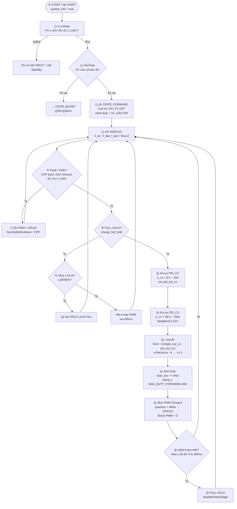

# โฟลว์ชาร์ต Forward (จากโค้ดหลัก) — มีหมายเลข + อธิบายไทย

อ้างอิงเฟิร์มแวร์: `firmware/charger_main.ino`  
แท็ก: `cv58-stability-v14-cv-stable`  
โหมด **STATE_FORWARD** (AC → ชาร์จแบต) ใช้ PID คู่ CC/CV แล้วเอาค่าน้อยกว่า

ค่าจริงในโค้ดตอนนี้:

| รายการ | ค่าในโค้ด |
|--------|-----------|
| `PWM_FREQ` | **50 kHz** |
| `TARGET_CC_CURRENT` | **6.0 A** |
| `TARGET_CV_VOLTAGE` | **56.00 V** |
| `MAX_DUTY_FORWARD` | **490 / 1023 ≈ 47.9%** |
| `RESTART_CHARGE_VOLTAGE` | **54.0 V** |
| `HIGH_VOLTAGE_STOP_VOLTAGE` | **56.80 V** |
| `FULL_END_CURRENT` | **0.50 A** |

> แนะนำฮาร์ดแวร์ Forward + Nr: ตั้ง `MAX_DUTY_FORWARD ≤ 460` (~45%) เพื่อรีเซ็ตฟลักซ์ทัน

ไฟล์ Mermaid: [`flowchart-forward-firmware.mmd`](flowchart-forward-firmware.mmd)

---

## แผนภาพ (①–⑮)



---

## อธิบายแต่ละขั้น (ภาษาไทย)

| ขั้น | ในโค้ดทำอะไร | อธิบายสั้น |
|------|----------------|------------|
| **①** | ปุ่ม START (`BUTTON_START_PIN`) | ผู้ใช้กดเริ่ม → `system_ON = true` (ถ้าไม่มี OVP และมีไฟเข้า) |
| **②** | เช็ก `v_solar` / `v_ac_in` | ต้องมี PV ≥ 42 V หรือ AC ≥ 140 V ไม่งั้นขึ้นข้อความไม่มีไฟ |
| **③** | เลือก `STATE_BOOST` หรือ `STATE_FORWARD` | **มี PV ใช้บูสต์ก่อน**; ไม่มี PV แต่มี AC → Forward |
| **④** | เข้า Forward | ปิดรีเลย์ PV, เปิดรีเลย์ AC, ตั้ง `raw_duty/duty_accumulator = 10` (ซอฟต์สตาร์ทเบาๆ), เคลียร์อินทิกรัล PID |
| **⑤** | `TaskSampleData` + ADS1115 | อ่านแรงดัน/กระแส, กรอง `v_bat_filt`, `i_bat_charge_filt` |
| **⑥** | ตรวจความปลอดภัย | OVP latch, ADC ค้างเกิน 700 ms, หรือ AC ต่ำกว่าเกณฑ์ → ต้องตัด |
| **⑦** | `forceSafeShutdown` / `disablePowerStage` | ปิด PWM ทั้ง Forward/Boost และรีเลย์ |
| **⑧** | `charge_full_hold` | โหมดพักหลังชาร์จเต็ม/หยุดแรงดันสูง |
| **⑨–⑩** | `RESTART_CHARGE_VOLTAGE = 54V` | แบตตกถึง 54 V และยังมีไฟ → ปลด HOLD แล้วชาร์จต่อ |
| **⑪** | PID CC | เป้ากระแส 6 A: ผิดพลาด `6 − Ibat` → `pid_out_cc` |
| **⑫** | PID CV | เป้าแรงดัน 56 V: ผิดพลาด `56 − Vbat` (ในแถบ ±0.12 V ถือว่า 0) → `pid_out_cv` |
| **⑬** | `min(CC, CV)` | ใช้คำสั่งที่**น้อยกว่า** → ใกล้เต็ม CV จะบีบกระแสเองโดยไม่ต้องสลับสเตตชัดๆ |
| **⑭** | `duty_accumulator` | รวมคำสั่ง PID แล้วคลัมป์ไม่เกิน 490 (≈47.9% ที่ความละเอียด 10 บิต) |
| **⑮** | `ledcWrite(PWM_FORWARD_PIN, …)` | ส่ง PWM ออกขา 14 ความถี่ 50 kHz; ขา Boost = 0 |
| **⑯–⑰** | High-voltage stop | `Vbat ≥ 56.8V` ต่อเนื่อง 300 ms → FULL HOLD |

---

## สูตรสำคัญในโหมด Forward (ตรงโค้ด)

```text
e_cc = TARGET_CC_CURRENT - i_bat_charge_filt          // 6.0 - Ibat
e_cv = TARGET_CV_VOLTAGE - v_bat_filt                 // 56.0 - Vbat
       (ถ้า |e_cv| ≤ 0.12 → e_cv = 0, ลดอินทิกรัล)

pid_out_cc = Kp_cc*e_cc + Ki_cc*∫e_cc + Kd_cc*Δe_cc
pid_out_cv = Kp_cv*e_cv + Ki_cv*∫e_cv + Kd_cv*Δe_cv

final = min(pid_out_cc, pid_out_cv)
final ∈ [-4.0, +1.5]          // จำกัดความเร็วปรับ
duty_accumulator += final
duty_accumulator ∈ [0, 490]   // MAX_DUTY_FORWARD
raw_duty = quantizeDutyWithDither(duty_accumulator)
PWM_FORWARD ← raw_duty @ 50 kHz
```

---

## ลำดับท่องจำ (Forward)

1. **กด START → มี AC → เข้า Forward**  
2. **อ่านเซนเซอร์ / กันฟอลต์**  
3. **PID กระแส 6 A และ PID แรงดัน 56 V**  
4. **ใช้ค่าที่น้อยกว่า → ปรับ Duty ≤ 490**  
5. **แรงดันสูงมาก / เต็ม → HOLD; ตกถึง 54 V → ชาร์จใหม่**

---

## ต่างจากโหมด BOOST ในโค้ดเดียวกัน

| | FORWARD (AC) | BOOST (PV) |
|--|--------------|------------|
| สเตตเครื่อง | `STATE_FORWARD` | `SOFTSTART → CC_MPPT → CV → DONE` |
| ควบคุม | PID คู่ + `min()` | MPPT + PI กระแส/แรงดันแยกโหมด |
| เป้า CV | 56.0 V | 56.0 V |
| Duty max | 490 | 760 |
| PWM ขา | GPIO 14 | GPIO 27 |
