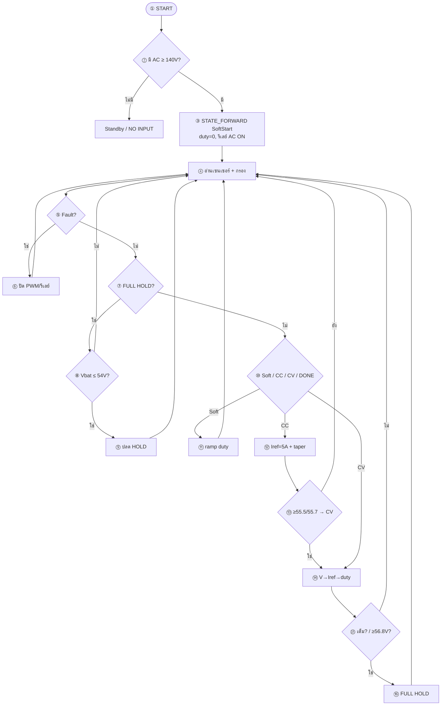

# โฟลว์ชาร์ต Forward (จากโค้ดหลัก) — มีหมายเลข + อธิบายไทย

อ้างอิงเฟิร์มแวร์: `firmware/charger_main.ino`  
แท็ก: `cv58-forward-67khz-5a-v16`  
โหมด **STATE_FORWARD** (AC → ชาร์จแบต) ใช้ **SoftStart → CC → CV → DONE**

ค่าจริงในโค้ดตอนนี้:

| รายการ | ค่าในโค้ด |
|--------|-----------|
| `PWM_FREQ` | **67 kHz** |
| `TARGET_CC_CURRENT` | **5.0 A** |
| `TARGET_CV_VOLTAGE` | **56.00 V** |
| `MAX_DUTY_FORWARD` | **460 / 1023 ≈ 45%** |
| `RESTART_CHARGE_VOLTAGE` | **54.0 V** |
| `HIGH_VOLTAGE_STOP_VOLTAGE` | **56.80 V** |
| `FULL_END_CURRENT` | **0.50 A** |

เอกสารไทยฉบับเต็ม: [`flowchart-forward-only.md`](flowchart-forward-only.md)  
ไฟล์ Mermaid: [`flowchart-forward-only.mmd`](flowchart-forward-only.mmd)

---

## แผนภาพสรุป



---

## สูตรสำคัญ

```text
SoftStart → CC (Iref=5A, taper ใกล้ 56V)
         → CV (voltage PI → Iref, current PI → duty)
         → DONE / FULL HOLD
duty ≤ 460, PWM @ 67 kHz on GPIO 14
```
