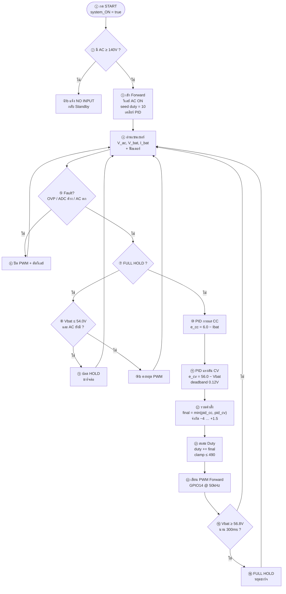

# โฟลว์ชาร์ตเฉพาะ Forward (AC → ชาร์จแบต)

เฉพาะ `STATE_FORWARD` จากโค้ดหลัก `cv58-stability-v14-cv-stable`  
ไม่รวม Boost / MPPT / PV

| รายการ | ค่า |
|--------|-----|
| ความถี่ | 50 kHz |
| PWM | GPIO 14 |
| CC | 6.0 A |
| CV | 56.0 V |
| Duty max | 490 / 1023 (~47.9%) — แนะนำ ≤460 ถ้าใช้ Nr=Np |
| รีชาร์จ | Vbat ≤ 54.0 V |
| หยุดแรงดันสูง | Vbat ≥ 56.8 V นาน 300 ms |

Mermaid: [`flowchart-forward-only.mmd`](flowchart-forward-only.mmd)

---

## แผนภาพ



---

## อธิบายภาษาไทย

| ขั้น | ความหมาย |
|------|----------|
| **①** | ผู้ใช้กด START เปิดระบบ |
| **②** | ต้องมีแรงดัน AC เข้า ≥ 140 V |
| **③** | เข้าโหมด Forward: เปิดรีเลย์ AC, ตั้ง duty เริ่มต้น 10, เคลียร์อินทิกรัล PID |
| **④** | อ่าน V_ac / V_bat / I_bat จาก ADS1115 แล้วกรอง |
| **⑤–⑥** | มี OVP, ADC ค้าง, หรือ AC ตก → ปิด PWM และรีเลย์ |
| **⑦–⑨** | ถ้าอยู่ใน FULL HOLD: แบตตกถึง 54 V และยังมี AC → ชาร์จใหม่; ยังไม่ตก → คงหยุด |
| **⑩** | PID เป้ากระแส 6 A |
| **⑪** | PID เป้าแรงดัน 56 V (ในแถบ ±0.12 V ถือว่าถึงเป้าแล้ว) |
| **⑫** | ใช้ค่าที่**น้อยกว่า**ระหว่าง CC กับ CV → ใกล้เต็มจะบีบกระแสเอง |
| **⑬** | บวกเข้า duty สะสม แล้วไม่ให้เกิน 490 |
| **⑭** | ส่ง PWM ออกขา Forward |
| **⑮–⑯** | แรงดัน ≥ 56.8 V นาน 300 ms → FULL HOLD |

---

## สูตรในลูป Forward

```text
e_cc = 6.0 − Ibat
e_cv = 56.0 − Vbat          (ถ้า |e_cv| ≤ 0.12 → e_cv = 0)

pid_cc = Kp_cc·e_cc + Ki_cc·∫e_cc + Kd_cc·Δe_cc
pid_cv = Kp_cv·e_cv + Ki_cv·∫e_cv + Kd_cv·Δe_cv

final = min(pid_cc, pid_cv)     // จำกัดประมาณ −4 … +1.5
duty  = duty + final            // จำกัด 0 … 490
PWM_FORWARD ← duty @ 50 kHz
```

---

## ท่องจำสั้นๆ

1. มี AC → เข้า Forward  
2. อ่านค่า / กันฟอลต์  
3. PID 6A กับ PID 56V → ใช้ค่าน้อยกว่า  
4. ปรับ Duty ≤ 490 → ออก PWM  
5. สูงเกิน 56.8V → HOLD; ตกถึง 54V → ชาร์จใหม่  
