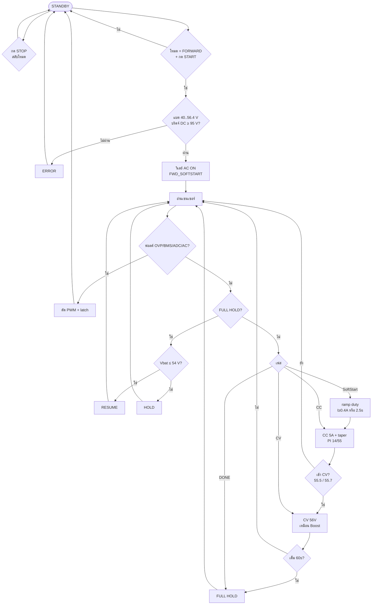

# โฟลว์ชาร์ต Forward — cv58-boost-v14-forward-v25

โหมด **STATE_FORWARD** (AC 110 V → ชาร์จแบต 56 V)  
วัดอินพุตที่ **ขาออกไดโอดบริดจ์ (DC)**  
ลูปควบคุม **คล้าย Boost** (SoftStart→CC→CV→DONE, PI/CV ชุดเดียวกัน — ไม่มี MPPT)

ไฟล์ Mermaid: [`flowchart-forward-only.mmd`](flowchart-forward-only.mmd)

---

## ค่าในโค้ด

| รายการ | ค่า |
|--------|-----|
| PWM | **67 kHz**, GPIO 14 |
| CC / CV | **5.0 A** / **56.0 V** |
| Duty max | **460** (~45%, Nr=Np) |
| บริดจ์ DC ขั้นต่ำ | **95 V** (AC 110 V) |
| SoftStart | seed ~80, พร้อมเมื่อ **I≥0.4 A หรือ 2.5 s** (เหมือน Boost) |
| Curr/Volt PI | **14/55** และ **0.85/0.45** (เหมือน Boost) |
| เข้า CV | ≥55.5 V confirm / ≥55.7 V force |
| FULL | V≥55.9 และ I≤0.5 A นาน 60 s |
| รีชาร์จ | ≤ 54.0 V |

---

## แผนภาพรวม



```text
STOP เลือก FORWARD → START
  → SoftStart (เหมือน Boost) → CC 5A → CV 56V → FULL HOLD
```
