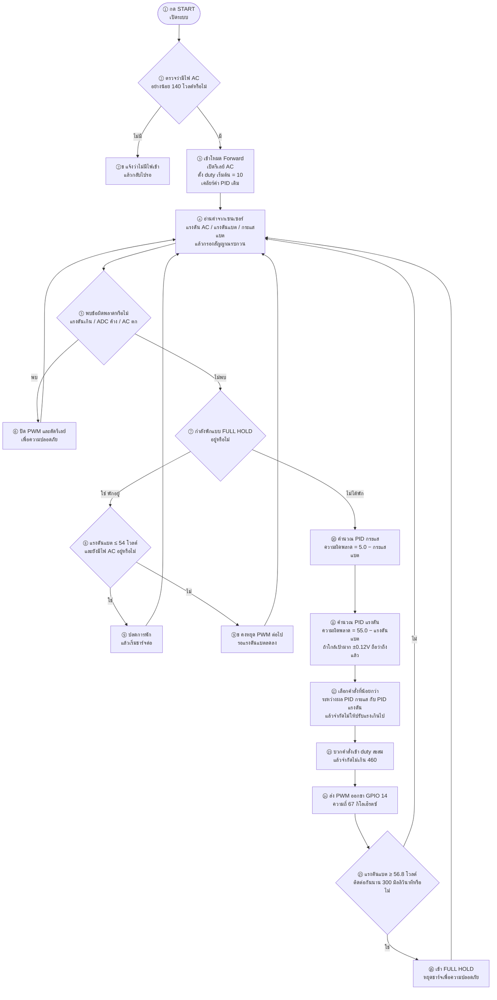

# โฟลว์ชาร์ตเฉพาะ Forward — อธิบายภาษาไทยทีละขั้น

โหมด **STATE_FORWARD** เท่านั้น (AC → ชาร์จแบต)  
จากโค้ดหลัก `cv58-stability-v14-cv-stable`

---

## ค่าที่ใช้ในโค้ด

| รายการ | ค่า | ความหมาย |
|--------|-----|----------|
| ความถี่ PWM | **67 kHz** | ความเร็วสวิตช์ MOSFET Forward (`PWM_FREQ = 67000`) |
| ขา PWM | GPIO 14 | ขับเกตฝั่ง Forward |
| กระแสเป้า (CC) | 5.0 A | ชาร์จกระแสคงที่ |
| แรงดันเป้า (CV) | 56.0 V | ชาร์จแรงดันคงที่ |
| Duty สูงสุด | **460 / 1023 (~45%)** | จำกัดเพื่อรีเซ็ตขด Nr (เดิมในโค้ดเป็น 490) |
| จุดรีชาร์จ | 54.0 V | แบตตกถึงค่านี้แล้วชาร์จใหม่ |
| หยุดฉุกเฉิน | 56.8 V / 300 ms | แรงดันสูงเกิน → FULL HOLD |

---

## แผนภาพรวม



---

## อธิบายทีละขั้นตอน (ภาษาไทย)

### ① กด START — เปิดระบบ
ผู้ใช้กดปุ่มเริ่มงาน โปรแกรมตั้งค่า `system_ON = true` เพื่ออนุญาตให้วงจรกำลังทำงาน

### ② ตรวจว่ามีไฟ AC หรือไม่
วัดแรงดันขาเข้า AC ต้อง **≥ 140 โวลต์**  
- **ไม่มี** → ไปขั้น ②ข  
- **มี** → ไปขั้น ③

### ②ข ไม่มีไฟเข้า
แสดงข้อความว่าไม่มีไฟ (NO INPUT) แล้วกลับสถานะรอ ไม่เปิดรีเลย์/PWM

### ③ เข้าโหมด Forward
1. เปิดรีเลย์ฝั่ง AC  
2. ตั้ง duty เริ่มต้น = 10 (ซอฟต์สตาร์ทเบาๆ)  
3. เคลียร์ค่าสะสมของ PID กระแสและแรงดันให้เริ่มใหม่

### ④ อ่านค่าเซนเซอร์
อ่านจาก ADS1115 แล้วกรอง:
- แรงดัน AC (`V_ac`)
- แรงดันแบต (`V_bat`)
- กระแสชาร์จแบต (`I_bat`)

### ⑤ ตรวจข้อผิดพลาด (Fault)
ตรวจอย่างน้อยดังนี้:
- **OVP** แรงดันสูงเกินจนล็อกไว้  
- **ADC ค้าง** อ่านค่าไม่ได้เกินเวลาที่กำหนด  
- **AC ตก** ต่ำกว่า 140 โวลต์ระหว่างทำงาน  

ถ้าพบ → ขั้น ⑥  
ถ้าไม่พบ → ขั้น ⑦

### ⑥ ปิด PWM และตัดรีเลย์
ปิดเอาต์พุตกำลังทั้งหมดเพื่อความปลอดภัย แล้ววนกลับไปอ่านเซนเซอร์ใหม่ (ขั้น ④)

### ⑦ กำลังอยู่ใน FULL HOLD หรือไม่
FULL HOLD = โหมดพักหลังชาร์จเต็มหรือหยุดเพราะแรงดันสูง  
- **กำลังพัก** → ขั้น ⑧  
- **ไม่ได้พัก** → ขั้น ⑩ (เข้าลูปควบคุมปกติ)

### ⑧ ถึงจุดรีชาร์จหรือยัง
ขณะพัก ถ้าแรงดันแบต **≤ 54.0 โวลต์** และยังมีไฟ AC  
- **ใช่** → ขั้น ⑨ ปลดพักแล้วชาร์จต่อ  
- **ไม่** → ขั้น ⑨ข คงหยุดต่อไป

### ⑨ ปลด FULL HOLD
ยกเลิกสถานะพัก แล้วกลับไปอ่านเซนเซอร์ (ขั้น ④) เพื่อชาร์จรอบใหม่

### ⑨ข คงหยุด PWM
ยังไม่รีชาร์จ เพราะแบตยังสูงอยู่ รอแรงดันลดลงเอง

### ⑩ PID กระแส (โหมด CC)
คำนวณความผิดพลาดกระแส:

\[
e_{cc} = 5.0 - I_{bat}
\]

แล้วผ่าน PID ได้คำสั่งปรับฝั่งกระแส (`pid_cc`)  
เป้าคือดันกระแสให้เข้าใกล้ **5 แอมป์**

### ⑪ PID แรงดัน (โหมด CV)
คำนวณความผิดพลาดแรงดัน:

\[
e_{cv} = 55.0 - V_{bat}
\]

ถ้าอยู่ในแถบ ±0.12 โวลต์ ถือว่าถึงเป้าแล้ว (`e_cv = 0`)  
ได้คำสั่งปรับฝั่งแรงดัน (`pid_cv`) เป้า **56 โวลต์**

### ⑫ รวมคำสั่ง — เลือกค่าน้อยกว่า
\[
final = \min(pid_{cc},\, pid_{cv})
\]

จากนั้นจำกัดความเร็วการปรับประมาณ **−4 ถึง +1.5** ต่อรอบ  
ผลคือ:
- แบตยังต่ำ → มักติด CC ที่ 5 A  
- ใกล้ 56 V → CV บีบกระแสลงเอง โดยไม่ต้องสลับโหมดแยกสเตต

### ⑬ สะสมและจำกัด Duty
\[
duty = duty + final
\]
แล้วบังคับให้อยู่ในช่วง **0 ถึง 460** (~45% ที่ความละเอียด 10 บิต)

### ⑭ เขียน PWM ออกขา Forward
ส่งค่า duty ไปที่ **GPIO 14** ความถี่ **67 kHz** เพื่อขับ MOSFET ฟอร์เวิร์ด

### ⑮ ตรวจหยุดเพราะแรงดันสูง
ถ้าแรงดันแบต **≥ 56.8 โวลต์** ติดต่อกันนาน **300 มิลลิวินาที**  
- **ใช่** → ขั้น ⑯  
- **ไม่** → กลับขั้น ④ ทำงานต่อ

### ⑯ เข้า FULL HOLD
หยุด PWM / ตัดกำลัง เข้าโหมดพักเพื่อกันแรงดันพุ่ง แล้ววนกลับไปอ่านเซนเซอร์ (ขั้น ④)

---

## สูตรสรุปในลูปควบคุม

```text
①→②→③ เข้า Forward
     ↓
④ อ่าน V_ac, V_bat, I_bat
     ↓
⑤–⑥ ถ้าพัง → ปิด PWM
     ↓
⑦–⑨ ถ้า FULL HOLD → รอจน Vbat ≤ 54V แล้วค่อยชาร์จใหม่
     ↓
⑩ e_cc = 5.0 − Ibat     → pid_cc
⑪ e_cv = 55.0 − Vbat    → pid_cv
⑫ final = min(pid_cc, pid_cv)
⑬ duty = clamp(duty + final, 0..460)
⑭ PWM_FORWARD ← duty @ 67 kHz
⑮–⑯ ถ้า Vbat ≥ 56.8V นาน 300ms → FULL HOLD
     ↓
กลับ ④
```

---

## ท่องจำสั้นๆ 6 ข้อ

1. **มี AC ถึงจะเข้า Forward**  
2. **อ่านค่าก่อน แล้วค่อยกันฟอลต์**  
3. **PID กระแส 5A กับ PID แรงดัน 56V ทำพร้อมกัน**  
4. **ใช้คำสั่งที่น้อยกว่า** เพื่อคุมทั้งกระแสและแรงดัน  
5. **Duty ไม่เกิน 460** แล้วค่อยออก PWM @ 67 kHz  
6. **สูงเกิน 56.8V → พัก; ตกถึง 54V → ชาร์จใหม่**  
