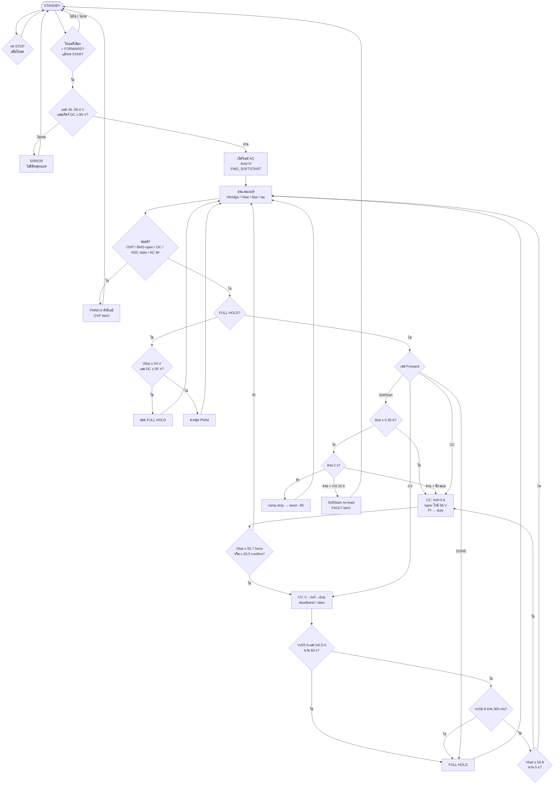

# โฟลว์ชาร์ต Forward — cv58-boost-v14-forward-v23

โหมด **STATE_FORWARD** (AC 110 V → ชาร์จแบต 56 V)  
วัดอินพุตที่ **ขาออกไดโอดบริดจ์ (DC)**

ไฟล์ Mermaid: [`flowchart-forward-only.mmd`](flowchart-forward-only.mmd)

---

## ค่าในโค้ด

| รายการ | ค่า |
|--------|-----|
| PWM | **67 kHz**, GPIO 14 |
| CC / CV | **5.0 A** / **56.0 V** |
| Duty max | **460** (~45%, Nr=Np) |
| บริดจ์ DC ขั้นต่ำ | **95 V** (AC 110 V) |
| หน้าต่างแบตก่อน START | **40.0 … 56.4 V** |
| SoftStart | seed duty ~80, 2 s / I≥0.35 A |
| SoftStart fault | timeout + I&lt;0.15 A → latch |
| เข้า CV | ≥55.5 V confirm / ≥55.7 V force |
| FULL | V≥55.9 และ I≤0.5 A นาน 60 s |
| รีชาร์จ | ≤ 54.0 V |
| หยุดฉุกเฉิน | ≥ 56.8 V นาน 300 ms |

---

## แผนภาพรวม



---

## เฟสควบคุมสั้นๆ

```text
STOP (STANDBY) → เลือก FORWARD
START → เช็กแบต + บริดจ์ DC ≥ 95 V
  → SoftStart (ramp duty)
      → CC (5 A, taper ใกล้ CV)
          → CV (56 V)
              → DONE / FULL HOLD
                  → รีชาร์จเมื่อ Vbat ≤ 54 V
```

### Safety ระหว่างทำงาน
- Hard OVP 57.8 V → latch (เคลียร์ด้วย STOP เมื่อแรงดันลด)
- BMS-open / spike ใกล้ 56 V → ตัด PWM
- Ibat &gt; 5.75 A หรือ |Iac| &gt; 2.5 A → latch
- Duty cap ใกล้โซน BMS

---

## ไฟล์ที่เกี่ยวข้อง

| ไฟล์ | เนื้อหา |
|------|---------|
| [`flowchart-forward-only.mmd`](flowchart-forward-only.mmd) | Mermaid ล้วน |
| [`../firmware/FORWARD_CONTROL_NOTES.md`](../firmware/FORWARD_CONTROL_NOTES.md) | โน้ตค่าคงที่/ลูป |
| [`../firmware/firmware.ino`](../firmware/firmware.ino) | โค้ดจริง |
