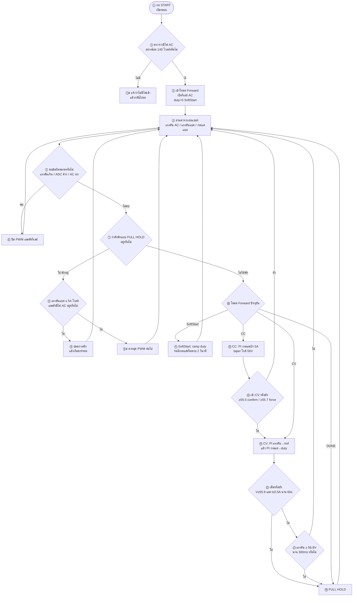

# โฟลว์ชาร์ตเฉพาะ Forward — อธิบายภาษาไทยทีละขั้น

โหมด **STATE_FORWARD** เท่านั้น (AC → ชาร์จแบต)  
จากโค้ดหลัก `cv58-forward-67khz-5a-v16`

---

## ค่าที่ใช้ในโค้ด

| รายการ | ค่า | ความหมาย |
|--------|-----|----------|
| ความถี่ PWM | **67 kHz** | ความเร็วสวิตช์ MOSFET Forward (`PWM_FREQ = 67000`) |
| ขา PWM | GPIO 14 | ขับเกตฝั่ง Forward |
| กระแสเป้า (CC) | 5.0 A | ชาร์จกระแสคงที่ |
| แรงดันเป้า (CV) | 56.0 V | ชาร์จแรงดันคงที่ |
| Duty สูงสุด | **460 / 1023 (~45%)** | จำกัดเพื่อรีเซ็ตขด Nr |
| จุดรีชาร์จ | 54.0 V | แบตตกถึงค่านี้แล้วชาร์จใหม่ |
| หยุดฉุกเฉิน | 56.8 V / 300 ms | แรงดันสูงเกิน → FULL HOLD |

---

## แผนภาพรวม



---

## อธิบายทีละขั้นตอน (ภาษาไทย)

### ①–⑨ เปิดระบบ / ฟอลต์ / FULL HOLD
เหมือนเดิม: ต้องมี AC ≥ 140 V, กัน OVP/ADC timeout/AC ตก, พักเมื่อเต็มแล้วรีชาร์จที่ ≤ 54 V

### ③ เข้าโหมด Forward
1. เปิดรีเลย์ฝั่ง AC  
2. ตั้ง `duty = 0` แล้วเข้า **FWD_SOFTSTART**  
3. เคลียร์อินทิเกรเตอร์ของลูปกระแส/แรงดัน

### ⑩–⑪ SoftStart
ค่อยๆ ดัน duty ไปยัง seed (~80 raw) ด้วย slew จำกัด  
พร้อมเข้า CC เมื่อมีกระแสชาร์จ ≥ 0.35 A หรือครบ 2 วินาที

### ⑫ CC (กระแสคงที่)
- เป้า `Iref = 5.0 A`  
- ใกล้ 54.8–56 V จะ taper กระแสลงก่อนเข้า CV  
- ปรับ duty ด้วย PI + slew ไม่เกิน 460

### ⑬–⑭ CV (แรงดันคงที่)
- เข้าเมื่อ Vbat ≥ 55.5 V (ยืนยันสั้นๆ) หรือ ≥ 55.7 V (บังคับ)  
- ลูปนอก: แรงดัน → คำสั่งกระแส (`Iref`)  
- ลูปใน: กระแส → ปรับ duty  
- ในแถบ ±0.12 V แช่ duty; เกินเป้าลด duty เบาๆ

### ⑮–⑰ เต็ม / หยุดฉุกเฉิน
- **เต็มปกติ:** V ≥ 55.9 V และ I ≤ 0.5 A นาน 60 s → FULL HOLD  
- **ฉุกเฉิน:** V ≥ 56.8 V นาน 300 ms → FULL HOLD  

---

## สูตรสรุปในลูปควบคุม

```text
①→②→③ เข้า Forward (SoftStart)
     ↓
④ อ่าน V_ac, V_bat, I_bat
     ↓
⑤–⑥ ถ้าพัง → ปิด PWM
     ↓
⑦–⑨ ถ้า FULL HOLD → รอจน Vbat ≤ 54V
     ↓
SoftStart → CC (Iref=5A + taper) → CV (V→Iref→duty) → DONE
duty = clamp(slew(...), 0..460)
PWM_FORWARD ← duty @ 67 kHz
     ↓
กลับ ④
```

---

## ท่องจำสั้นๆ 6 ข้อ

1. **มี AC ถึงจะเข้า Forward**  
2. **SoftStart ก่อน แล้วค่อย CC**  
3. **CC ที่ 5 A แล้วสลับ CV ที่ ~55.5 V**  
4. **CV ใช้ลูปซ้อน แรงดัน→กระแส→duty**  
5. **Duty ไม่เกิน 460** แล้วค่อยออก PWM @ 67 kHz  
6. **สูงเกิน 56.8 V → พัก; ตกถึง 54 V → ชาร์จใหม่**  
