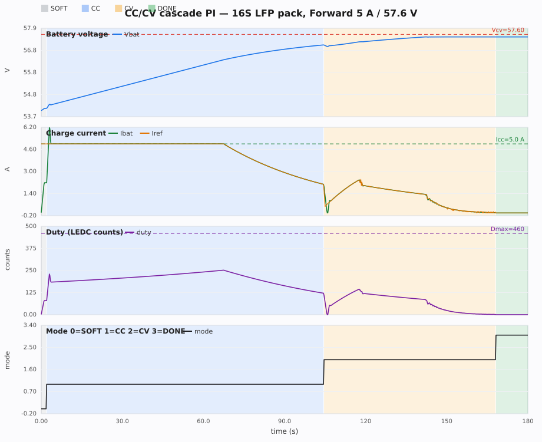
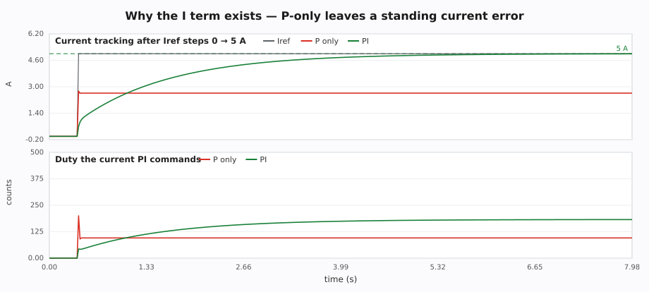

# เรียน CC / CV PI control

สื่อนี้สอนโครงควบคุมที่ชาร์จเจอร์นี้ใช้จริง: **ลูปกระแส PI ซ้อนในลูปแรงดัน PI** สำหรับแพ็ก **16S LiFePO4** (เป้าชาร์จ 5 A / 57.6 V)

สมการครบชุด (ต่อเนื่อง + ดิสครีตตามโค้ด): **[cc-cv-pi-equations.md](cc-cv-pi-equations.md)**

รันจำลองก่อน แล้วค่อยอ่านทฤษฎี:

```bash
python3 learn/simulate_cc_cv.py
python3 learn/simulate_cc_cv.py --lab p-vs-pi
python3 -m unittest discover -s learn -p 'test_*.py'
```

ไฟล์ที่ได้: `learn/out/cc_cv_charge.svg` และ `.csv` (เปิดใน Excel ได้)

---

## 1. ปัญหาที่ต้องแก้

ชาร์จแบตคือการเติมคูลอมบ์ แต่มีเพดานสองอันที่ห้ามชนพร้อมกัน:

| เพดาน | ชื่อ | ของเครื่องนี้ | ถ้าฝ่า |
|---|---|---|---|
| กระแส | **CC** Constant Current | Forward **5.0 A** (หม้อแปลง) / Boost 6.0 A | ร้อน, แกนอิ่มตัว, สาย/ฟิวส์ |
| แรงดัน | **CV** Constant Voltage | **57.60 V** (3.60 V/เซลล์) | เซลล์เต็มเกิน, BMS ตัด FET |

BMS ของแพ็กนี้ (HXYP 16S) ตัดที่ 3.65 V/เซลล์ = **58.40 V**  
ชาร์จเจอร์จึงตั้ง CV ต่ำกว่า BMS **0.80 V** เพื่อให้ชาร์จเจอร์จบเอง ไม่ให้ FET ของ BMS เปิดกลางทาง

ช่วงแพ็กยังว่าง แรงดันต่ำ — ตัวจำกัดที่ทำงานคือ **กระแส**  
ช่วงใกล้เต็ม แรงดันไต่เข้าเป้า — ตัวจำกัดที่ทำงานคือ **โวลต์** และกระแสจะลดเอง (taper)

นั่นคือโปรไฟล์ **CC แล้วค่อย CV** ที่ทุกเครื่องชาร์จลิเธียมใช้


---

## 2. PI คืออะไร ทำไมไม่ใช้แค่ P หรือ PID

ทุกตัวควบคุมในนี้ดู **error** แล้วออกคำสั่ง:

```text
error = เป้า − ของที่วัดได้
```

- โหมด CC: `error = Iref − Ibat`  แล้วคำสั่งคือ **Δduty** (ขยับ PWM)
- โหมด CV: `error = Vref − Vbat`  แล้วคำสั่งคือ **Iref** (แอมป์) ไม่ใช่ duty

ตัวควบคุม **PI** รวมสองส่วน:

```text
P = Kp × error                         # ตอบทันที ตาม error ตอนนี้
I = I + Ki × error × dt                # สะสม error ตามเวลา
u = saturate(P + I, umin, umax)
```

`dt` ของเครื่องนี้คือ **0.02 s** (ลูปควบคุม 50 Hz)  
อย่าสับสนกับ PWM **67 kHz** — นั่นเป็นแค่คลื่นสวิตช์ ไม่ใช่คาบที่ PI คิด

| เทอม | หน้าที่ | ถ้ามากไป | ถ้าน้อยไป |
|---|---|---|---|
| **P (Kp)** | ดึงเร็วเมื่อ error ใหญ่ | แกว่ง / เสียงหึ่ง | ไต่ช้า รู้สึกนิ่ม |
| **I (Ki)** | ลบ error ค้าง (steady-state) | โยนเกินเป้า แล้วเด้ง | ค้างไม่ถึงเป้า |
| **D (Kd)** | ไม่ใช้ในเฟิร์มแวร์นี้ | ขยายสัญญาณรบกวนจากเซนส์กระแส | — |

รันแล็บที่พิสูจน์ว่าทำไมต้องมี I:

```bash
python3 learn/simulate_cc_cv.py --lab p-vs-pi
```

แล็บนี้ใช้ PI แบบออก **duty ตรงๆ** (position form)  
แพลนต์มี “ความต้าน” — P อย่างเดียวต้องมี error ค้างถึงจะได้ duty พอ (จำลองจบที่ ~2.6 A จากเป้า 5 A)  
I สะสม error นั้นจน duty ไปอยู่ที่ค่าที่ถูกต้อง แล้ว error กลับเป็นศูนย์

ในรอบชาร์จจริง เอาต์พุตของลูปกระแสเป็น **Δduty แล้วถูกสะสม** — ตัวสะสมเองก็เป็นอินทิกรัลอยู่แล้ว เลยต้องแยกแล็บนี้ถึงจะเห็นเทอม I ชัด

---

## 3. Anti-windup — อย่าให้อินทิกรัลพองตอนชนเพดาน

Duty มีเพดาน **0 .. 460** นับ (ประมาณ 45%)  
Iref ช่วง CV มีเพดาน **0 .. 3 A**

ถ้า error ยังมีอยู่ทั้งที่คำสั่งชนเพดานแล้ว แล้วยังบวก `Ki*e*dt` ต่อไป อินทิกรัลจะพอง  
พอสถานะกลับ (เช่น กระแสพุ่ง) ตัวควบคุมถอยช้ามาก เพราะต้อง “ระบาย” I ที่พองก่อน

กฎที่ใช้ทั้งบทเรียนและเฟิร์มแวร์:

> อัปเดตอินทิกรัล **เฉพาะเมื่อ** `P + I` ยังอยู่ใน `[umin, umax]`  
> ถ้าจะชนเพดาน — **แช่ I ไว้** แล้วตัดเอาต์พุตที่เพดาน

โค้ดตรงนี้คือ `learn/pi.py` ฟังก์ชัน `run_pi` ซึ่งเขียนให้ตรง `boostRunPI` ในเฟิร์มแวร์

---

## 4. ทำไมเป็นลูปซ้อน (cascade) ไม่ใช่ min(duty_cc, duty_cv)

โครงเก่าที่เคยลองในโปรเจกต์นี้: PI สองตัว **ขนาน** ทั้งคู่คิด duty แล้วเอาค่าที่เล็กกว่า

```text
duty = min( PI_cc(Iref − I),  PI_cv(Vref − V) )
```

ใช้ได้บนกระดาษ แต่บนบอร์ดสองลูปแย่งกัน:

- ทั้งคู่มีอินทิกรัลของตัวเอง → ตัวที่ “แพ้” (ไม่ได้ถูกเลือก) ยังพองอยู่
- สลับโหมดที่จุดโวลต์จุดเดียว ทำให้ duty กระตุก
- เคยใส่ Kd แล้วเซนส์กระแสที่เป็นริปเปิลถูกขยาย

โครงที่เฟิร์มแวร์ใช้ตอนนี้คือ **cascade** — มีลูปกระแสแค่ชุดเดียว:

```text
                 Vref = 57.60 V
                      │
                      ▼
              ┌───────────────┐
              │  PI แรงดัน    │  Kp=0.70  Ki=0.35
              │  (โหมด CV)    │  ออก 0..3 A
              └───────┬───────┘
                      │ Ireq  (slew ±0.06 A / 20 ms)
         โหมด CC: Iref = 5 A (taper ตั้งแต่ 56.40 V)
                      │
                      ▼
                 Iref − Ibat
                      │
              ┌───────────────┐
              │  PI กระแส     │  Kp=8  Ki=35
              │  (ทุกโหมด)    │  ออก Δduty −20..+25 นับ/ติ๊ก
              └───────┬───────┘
                      │
                      ▼
           duty = sat(duty + Δduty, 0, 460)
                      │
                      ▼
                  PWM 67 kHz
```

ลูปใน (กระแส) เร็ว — ดึง Ibat ตาม Iref  
ลูปนอก (แรงดัน) ช้า — ขยับ Iref เมื่อใกล้ 57.6 V  
สองลูปไม่แย่ง duty

จุดสำคัญตอนสลับ CC → CV: **รีเซ็ตอินทิกรัล** แล้วตั้ง Iref เท่ากระแสที่มีอยู่ (ประมาณ 0.3–2 A) เพื่อไม่ให้ duty กระตุก — เรียกว่าการส่งต่อแบบไม่สะดุด (bumpless)

---

## 5. เครื่องจักรโหมดบน Forward

| โหมด | เข้าเมื่อ | ตัวควบคุม | ออกเมื่อ |
|---|---|---|---|
| **SoftStart** | กดชาร์จ | ไต่ duty ไป ~80 นับ | เฟิร์มแวร์: I ≥ 0.35 A หรือครบ 2 s / จำลองสอนรอครบ 2 s เพื่อให้เห็นแถบเทา |
| **CC** | SoftStart จบ | PI กระแส, Iref = 5 A | V ≥ 57.10 นาน 200 ms (หรือ 57.30 ทันที) |
| **CV** | จาก CC | PI แรงดัน → Iref, PI กระแส → duty | V ≥ 57.40 และ I ≤ 0.50 A นานพอ → **DONE** |
| **DONE** | เต็ม | duty = 0 | V ≤ 53.60 แล้วเริ่ม CC ใหม่ |

ก่อนเข้า CV จริง ช่วง V ≥ 56.40 โค้ด **taper** Iref ลงตามโวลต์ที่เหลือ เพื่อไม่ให้ชน 57.6 แบบหน้าผา

ฮิสเทอรีซิสเข้า 57.10 / ออก 56.40 สำคัญมาก — อย่าใช้จุดเดียว (ของเก่าเคย Switch ที่ 55.8 แล้วโหมดกระพริบ)

---

## 6. ตัวเลขที่ต้องจำให้ตรงหน่วย

เกนในเฟิร์มแวร์ **ไม่ได้** ออก duty ทศนิยม 0–1

| ลูป | Kp | Ki | เอาต์พุต | เพดาน |
|---|---|---|---|---|
| กระแส | 8.0 | 35.0 | **Δduty นับ LEDC ต่อ 20 ms** | −20 .. +25 แล้วสะสม 0..460 |
| แรงดัน | 0.70 | 0.35 | **แอมป์ (Iref)** | 0 .. 3 A |

ถ้าเอา Kp=8 ไปวางบนลูปที่ออก 0–1 ใน Simulink duty จะชนเพดานทันที  
ถ้าเอา Kp=0.70 ไปออก duty โดยตรง โวลต์จะไม่ถูกควบคุม เพราะลูปแรงดันในโค้ดออกเป็นกระแส

---

## 7. ทดลองเอง

ค่าเริ่มต้นในสคริปต์ตั้งให้ตรงเฟิร์มแวร์ Forward v4

```bash
# เกนกระแสอ่อน — CC ไต่ช้า อาจไม่ถึง 5 A
python3 learn/simulate_cc_cv.py --kp-i 1 --ki-i 4

# เกนกระแสแรง — Ibat แกว่งรอบ 5 A
python3 learn/simulate_cc_cv.py --kp-i 30 --ki-i 120
```

สิ่งที่ควรเห็นในกราฟมาตรฐาน (`learn/out/cc_cv_charge.svg`):



1. **Vbat** ไต่จาก ~54 V แล้วชะลอเข้า 57.6 V ไม่พุ่งผ่าน 58.4 V
2. **Ibat** ช่วง CC ทับเส้น Iref ≈ 5 A จากนั้นช่วง CV ลดลงจน DONE
3. **duty** SoftStart ไต่จาก 0 แล้ว PI รับช่วง ไม่เกิน 460
4. **mode** SOFT สั้น → CC ยาว → CV → DONE

ทำไมต้องมีเทอม I (`learn/out/p_vs_pi.svg`):



ไฟล์ CSV คอลัมน์ `t_s, Vbat, Ibat, Iref, duty, mode` นำไปวาดทับใน Excel ได้

---

## 8. ของจริงที่เฟิร์มแวร์เพิ่ม (ยังไม่ใส่ในจำลองสอน)

จำลองสอนใส่เบรกใกล้เป้าชุดสั้น (แคบ Iref ในแถบ ±0.35 V และตัด duty ถ้า V เลย CV) เพื่อให้กราฟเกาะ 57.6 V ได้

บน ESP32 ยังมีเพิ่มจากนั้น:

- กรองโวลต์/กระแส และ deadband ±0.12 V ใกล้เป้า (ไม่ให้ลูปเกาตัวเองจากริปเปิล)
- ลด Kp/Ki กระแสเมื่อเข้าใกล้เป้า ±0.35 V
- ตัด duty ทันทีถ้าโวลต์เกิน CV หรือกระแสเกิน CC+0.25 A (คลัมป์ความปลอดภัย นอก PI)
- กัน BMS เปิด FET (จัมพ์โวลต์) ตั้งแต่ ~54.5 V
- Boost คนละเส้น: มี MPPT มากำหนด Iref ช่วง CC เพราะแหล่งเป็นแผง ไม่ใช่ AC แข็ง

โครง PI เดียวกัน — ต่างที่แหล่งพลังงานและเกน/slew

---

## 9. ไฟล์ในบทเรียนนี้

| ไฟล์ | หน้าที่ |
|---|---|
| [`learn/pi.py`](../learn/pi.py) | PI + anti-windup + slew |
| [`learn/simulate_cc_cv.py`](../learn/simulate_cc_cv.py) | แพลนต์ค่าเฉลี่ย + SoftStart/CC/CV |
| [`learn/test_cc_cv_pi.py`](../learn/test_cc_cv_pi.py) | ตรวจว่า CC เกาะ 5 A, CV เกาะโวลต์, P-only ยังมี error |
| [`learn/out/cc_cv_charge.svg`](../learn/out/cc_cv_charge.svg) | กราฟชาร์จเต็มรอบ |

สมการเดียวที่ควรท่อง:

```text
CC:  ลูปกระแสทำให้ I = Iref, โวลต์ยังขึ้นอิสระ
CV:  ลูปแรงดันลด Iref จน V = Vref, กระแสเหลือเท่าที่แบตยอมรับ
PI:  P ดึงเร็ว, I ลบ error ค้าง, แช่ I เมื่อชนเพดาน
```

รายละเอียดทุกบรรทัดพร้อม \(T_i = K_p/K_i\): [cc-cv-pi-equations.md](cc-cv-pi-equations.md)
